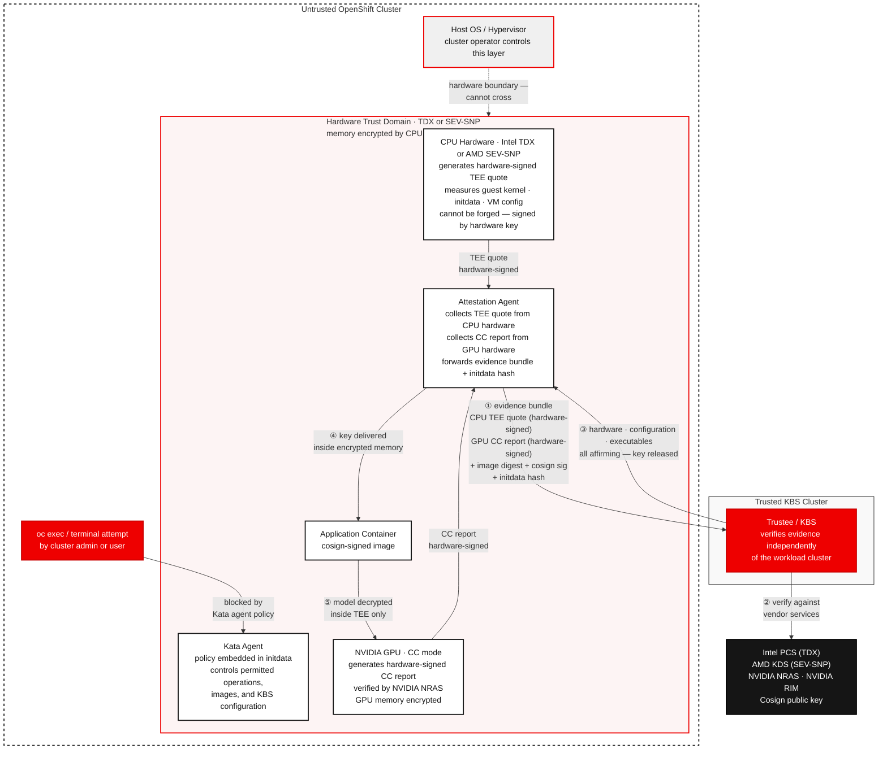
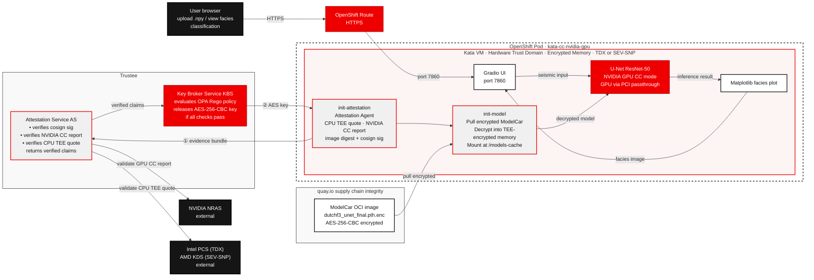

# Deploy Confidential GPU-Accelerated Seismic Interpretation

AI-powered classification from North Sea seismic data — run this quickstart within a confidential container on Red Hat® OpenShift® AI.

## Table of contents

- [Detailed description](#detailed-description)
  - [Who is this for?](#who-is-this-for)
  - [The business case for AI-driven seismic interpretation](#the-business-case-for-ai-driven-seismic-interpretation)
  - [Why the cluster is not the security boundary](#why-the-cluster-is-not-the-security-boundary)
  - [What this quickstart provides](#what-this-quickstart-provides)
  - [Architecture diagram](#architecture-diagram)
- [Requirements](#requirements)
  - [Minimum hardware requirements](#minimum-hardware-requirements)
  - [Minimum software requirements](#minimum-software-requirements)
  - [Network connectivity requirements](#network-connectivity-requirements)
  - [Required user permissions](#required-user-permissions)
- [Deploy](#deploy)
  - [Roles](#roles)
  - [Clone the repository](#clone-the-repository)
  - [Set your deployment namespace](#set-your-deployment-namespace)
  - [Enable TEE in server firmware and kernel parameters](#enable-tee-in-server-firmware-and-kernel-parameters)
  - [Kata containers setup — application deployer (cluster-admin, once per cluster)](#kata-containers-setup--application-deployer-cluster-admin-once-per-cluster)
  - [Intel TDX Quote Generation Service setup — application deployer (cluster-admin, once per cluster, Intel TDX only)](#intel-tdx-quote-generation-service-setup--application-deployer-cluster-admin-once-per-cluster-intel-tdx-only)
  - [Trustee setup — model owner (cluster-admin, once per cluster)](#trustee-setup--model-owner-cluster-admin-once-per-cluster)
    - [Install Trustee](#install-trustee)
    - [Patch default CPU policy to enforce initdata validation](#patch-default-cpu-policy-to-enforce-initdata-validation)
    - [Patch default CPU policy to allow older firmware versions](#patch-default-cpu-policy-to-allow-older-firmware-versions)
    - [Register RVPS reference values](#register-rvps-reference-values)
    - [Register app-specific secrets with KBS](#register-app-specific-secrets-with-kbs)
  - [Application deployment — application deployer (namespace admin)](#application-deployment--application-deployer-namespace-admin)
    - [Step 1: Create the project](#step-1-create-the-project)
    - [Step 2: Deploy the application](#step-2-deploy-the-application)
    - [Step 3: Get the application URL](#step-3-get-the-application-url)
  - [Use the application](#use-the-application)
    - [Upload seismic data](#upload-seismic-data)
    - [View results](#view-results)
  - [Verify confidential execution](#verify-confidential-execution)
    - [Attempt to access the running container](#attempt-to-access-the-running-container)
    - [Try to change the policy](#try-to-change-the-policy)
    - [Try to change the container arguments](#try-to-change-the-container-arguments)
    - [Try to run a different container](#try-to-run-a-different-container)
    - [Try to serve a different container](#try-to-serve-a-different-container)
    - [Closing thoughts on verifying confidential execution](#closing-thoughts-on-verifying-confidential-execution)
  - [Optional: Encrypt and publish your own model — model owner](#optional-encrypt-and-publish-your-own-model--model-owner)
  - [Optional: Build and publish your own application — model owner](#optional-build-and-publish-your-own-application--model-owner)
  - [What you've accomplished](#what-youve-accomplished)
  - [Delete](#delete)
- [Reference](#references)
- [Tags](#tags)

---

## Detailed description

### Who is this for?

This quickstart is designed for:

- **Petroleum engineers and geoscientists** who want to see AI applied to real subsurface field data without building a pipeline from scratch
- **Data scientists and ML engineers** exploring GPU-accelerated deep learning in the geoscience domain
- **Platform and security engineers** demonstrating confidential computing with GPU passthrough on OpenShift — using real, sensitive-class data as the workload

No prior seismic interpretation experience is required. Domain context is provided where needed.

### The business case for AI-driven seismic interpretation

Before drilling a well, geoscientists must answer a fundamental question: **where is the reservoir rock?**

The traditional answer involves a geologist manually interpreting a 3D seismic volume — tracing rock boundaries line by line through thousands of 2D cross-sections. A full field interpretation takes **weeks to months** of senior geologist time and reflects a single interpreter's judgement.

AI-driven seismic facies classification changes this:

| | Manual interpretation | AI model (this quickstart) |
|---|---|---|
| Time to full-field interpretation | Weeks–months | Minutes |
| Coverage | Sampled 2D sections | Every point in the 3D volume |
| Consistency | Interpreter-dependent | Deterministic |
| Cost | Senior geologist time | GPU compute |
| Scenario runs | 1–2 | Unlimited |

**The downstream impact is significant.** A better rock type map leads to better well placement decisions — and a single well in the North Sea costs $50M–$150M to drill. AI-assisted interpretation directly reduces the risk of drilling in the wrong location.

**Why confidential computing matters here.** Seismic data is among the most commercially sensitive assets an oil and gas company owns. Running AI interpretation on proprietary field data in a shared cloud or on-premises cluster exposes that data to the underlying infrastructure. Confidential computing hardware encrypts the memory of the inference process — the seismic data and model weights are never visible to the host OS, hypervisor, or any user with physical access to the node.

All controls over what runs inside the Trust Domain are cryptographically enforced through the initdata mechanism. The Kata agent policy — governing which operations are permitted inside the container, which images may run, and how the KBS is reached — is embedded in the pod's initdata. The hash of that initdata is included in the TEE attestation evidence, and the KBS will only release the model decryption key to a pod carrying the correct hash. Any modification to the policy, the KBS configuration, or the container image produces a different hash, fails attestation, and is denied the key. These controls cannot be bypassed by a cluster administrator — they are conditions of key release verified by hardware, not Kubernetes policies that can be overridden with sufficient privilege.

This quickstart uses Intel® TDX (Trust Domain Extensions) or AMD SEV-SNP on AMD EPYC platforms for CPU memory encryption. NVIDIA data center GPUs that support Confidential Computing mode (H100, H200, B100 and later) extend this protection to the GPU: GPU memory and the PCIe bus between CPU and GPU are also encrypted, closing the gap that would otherwise exist between the CPU Trust Domain and the accelerator.

### Why the cluster is no longer the security boundary

In a conventional container deployment, the cluster operator controls everything: the host OS, the container runtime, and the network. Any workload running on their cluster is ultimately visible to them — they can inspect container memory, attach a debugger, or intercept traffic. Trusting a workload therefore means trusting the operator of the cluster it runs on. This is the model most software assumes, and it is why sensitive AI inference is typically restricted to clusters that the data owner fully controls.

Confidential computing breaks this assumption. The hardware Trust Domain (Intel® TDX or AMD SEV-SNP) is enforced by the CPU itself — the host OS and hypervisor cannot read or modify memory inside it, regardless of what privileges they hold. The model decryption key is held by Red Hat® build of Trustee, which runs on a separate trusted cluster and releases the key only after independently verifying cryptographic evidence produced inside the TEE. Trustee does not ask the cluster whether it is trustworthy — it verifies the hardware directly. This means the workload cluster can be considered fully untrusted: even if an attacker controls the entire cluster, they cannot forge a valid CPU attestation quote, cannot fake the GPU Confidential Computing mode report, and cannot produce a valid cosign signature for the application image. Without all three, Trustee will not release the key, and the model cannot be decrypted.

Everything that touches sensitive data runs inside the secure VM, and none of it can be influenced by the untrusted cluster. The kata VM boots its own isolated guest kernel — separate from the host kernel that OpenShift controls — and every component inside it is part of the attestation measurement. The kata agent, which controls what processes run inside the VM, is supplied via the initdata blob whose hash KBS verifies. The Confidential Data Hub, which fetches the decryption key from KBS, runs inside the TEE and communicates with KBS over a TLS channel that the host network stack cannot intercept. The application container image is verified by cosign as part of attestation, so the cluster cannot substitute a different image without breaking the signature check. The cluster can schedule the pod and stop it, but it cannot change what runs inside the VM, modify the kata-agent policy, intercept the key in transit, or read the decrypted model from memory. The only role the untrusted cluster plays is to start the VM — everything after that is under hardware enforcement.

Memory encryption alone is not sufficient — without additional controls, an authorized user could still extract decrypted data at runtime by interacting with the running process, copying files out of it, or substituting a different container image that exfiltrates data through an unintended channel. To close these gaps, all controls over what runs inside the Trust Domain are enforced through the initdata mechanism. The Kata agent policy — governing permitted operations inside the container, which images may run, and how the KBS is reached — is embedded in the pod's initdata blob, and its hash is included in the TEE attestation evidence sent to Trustee. Trustee's attestation policy requires the correct initdata hash before releasing the key, meaning any pod that modifies the agent policy, changes the KBS configuration, or uses a different container image will produce a different hash, fail attestation, and never receive the decryption key. These controls are not Kubernetes policies that a cluster administrator could remove — they are cryptographically enforced conditions of key release, verified by hardware.

One attack surface that hardware and policy controls cannot eliminate is the behaviour of the application container itself. A container that intentionally exposes decrypted data — through an unauthenticated HTTP endpoint, an overly broad API response, or any other means — would undermine the protections above regardless of how well the TEE is configured. This is why the cosign image signature is a required attestation check: Trustee will only release the model decryption key to a container image that has been signed by the model owner's private key. The model owner is therefore responsible for ensuring that the signed image only exposes data in the intended way, and that no debug endpoints, data dump routes, or unintended egress paths exist. Any future version of the image must be re-signed by the model owner before it can receive the key — giving the model owner, not the cluster operator or application deployer, final control over what code runs inside the Trust Domain.



### What this quickstart provides

- ✓ A browser-based application for uploading, classifying, and visualising seismic data
- ✓ A U-Net ResNet-50 model trained on the Dutch F3 benchmark dataset (MIT license — commercial use permitted), published as an AES-256-CBC encrypted ModelCar OCI image at `quay.io/rh-ai-quickstart/conf-gpu-accel-seismic-interp-model`
- ✓ A [Trustee](https://github.com/confidential-containers/trustee) Key Broker Server that enforces a three-factor attestation policy before releasing the model decryption key
- ✓ Inference running inside a **Kata confidential container** backed by **Intel® TDX or AMD SEV-SNP** — seismic data and decrypted model weights protected in encrypted CPU memory, with GPU memory and the PCIe bus also encrypted via **NVIDIA Confidential Computing mode**
- ✓ GPU passthrough to the hardware Trust Domain via `kata-cc-nvidia-gpu` runtime

The following is an example of what the app looks like:


#### Key technologies you'll learn

**Confidential computing**
- [Intel® TDX (Trust Domain Extensions)](https://www.intel.com/content/www/us/en/developer/tools/trust-domain-extensions/overview.html) or [AMD SEV-SNP](https://www.amd.com/en/developer/sev.html) — hardware-level CPU memory encryption for the inference process
- [NVIDIA Confidential Computing](https://www.nvidia.com/en-us/data-center/solutions/confidential-computing/) — NVIDIA GPU running in CC mode (H100, H200, B100 and later), attestation via NVIDIA Remote Attestation Service (NRAS)
- [Kata Containers](https://katacontainers.io/) with `kata-cc-nvidia-gpu` runtime — GPU passthrough into the hardware Trust Domain
- [Trustee (KBS)](https://github.com/confidential-containers/trustee) — Key Broker Server enforcing three-factor attestation before releasing the model decryption key
- [Cosign / Sigstore](https://docs.sigstore.dev/cosign/overview/) — container image signing, verified as part of the KBS attestation policy

**Platform**
- [Red Hat® OpenShift® AI](https://www.redhat.com/en/technologies/cloud-computing/openshift/openshift-ai) with the Red Hat® OpenShift® Sandboxed Containers operator
- NVIDIA GPU with Confidential Computing mode support (H100, H200, B100 and later) with physical GPU (`pgpu`) passthrough and NVIDIA CC mode enabled

### Architecture diagram



---

## Requirements

### Minimum hardware requirements

**Note:** It is recommended that this quickstart only be deployed in a cluster not being used concurrently for other deployments. Installation requires multiple node reboots and applies configuration that may be incompatible with deployments not using confidential containers.

| Component | Minimum | Notes |
|---|---|---|
| GPU | NVIDIA GPU with Confidential Computing mode support (e.g. H100, H200, B100) | Hopper architecture and later support NVIDIA CC mode and NRAS attestation. |
| CPU | Intel® Xeon Scalable 4th Gen+ (Sapphire Rapids or later) with TDX, or AMD EPYC 9004 series (Genoa) with SEV-SNP | TEE must be enabled in the BIOS. TDX was introduced in 4th Gen Xeon Scalable (Sapphire Rapids). |
| RAM | 128GB | The kata VM takes 48GB, OCP control plane requires ~32GB, and GPU/OSC/Trustee system pods consume additional memory. |
| Storage | 50GB | For OpenShift AI, OSC and trustee deployments|

**NOTE:** At this point in time the quickstart has only been validated to work with Intel TDX; validation with AMD SEV-SNP is a work in progress.

### Minimum software requirements

| Software | Version | Notes |
|---|---|---|
| [OpenShift Container Platform](https://docs.redhat.com/en/documentation/openshift_container_platform) | 4.21.24+ | Required by OpenShift Sandboxed Containers 1.13 with confidential containers and GPU support (bare metal + GPU requires 4.21.24+) |
| [OpenShift Sandboxed Containers](https://docs.redhat.com/en/documentation/openshift_sandboxed_containers/1.13) | 1.13.0 | Provides the `kata-cc-nvidia-gpu` runtime class for confidential GPU workloads |
| [Red Hat OpenShift AI](https://www.redhat.com/en/technologies/cloud-computing/openshift/openshift-ai) | 3.4+ | Provides the model serving stack and installs the NVIDIA GPU Operator (26.3.0 required for confidential GPU support with OSC 1.13) |
| [Trustee (KBS)](https://github.com/confidential-containers/trustee) | 1.2.0 | `confidential-containers/trustee` — Key Broker Server, deployed as part of this quickstart |
| [Cosign](https://docs.sigstore.dev/cosign/overview/) | 2.0+ | For verifying model image signatures; installed locally for the [Optional: Encrypt and publish your own model](#optional-encrypt-and-publish-your-own-model--model-owner) and [Optional: Build and publish your own application](#optional-build-and-publish-your-own-application--model-owner) sections |
| [Python](https://www.python.org/downloads/) | 3.12 – 3.13 | Required locally for a number of the make targets |
| [uv](https://github.com/astral-sh/uv) | Latest | Fast Python package installer; used to manage dependencies for the optional local steps |
| [Podman](https://podman.io/getting-started/installation) | Latest | Container runtime for building and pushing images in the optional build steps |
| [Helm](https://helm.sh/docs/intro/install/) | 3.0+ | Kubernetes package manager; used to deploy the application |
| [oc CLI](https://docs.openshift.com/container-platform/latest/cli_reference/openshift_cli/getting-started-cli.html) | Matching OCP version | OpenShift command-line tool |
| [git](https://git-scm.com/downloads) | Latest | Required to clone this repository |
| [GNU Make](https://www.gnu.org/software/make/) | Latest | Build automation; pre-installed on most Linux and macOS systems |

### Network connectivity requirements

Attestation requires outbound HTTPS (port 443) access from the clusters to the following external services:

| From | Destination | Purpose |
|---|---|---|
| Workload cluster (Intel TDX only) | `api.trustedservices.intel.com` | Intel PCS — PCCS fetches PCK certificates from here to supply the QGS with material for building TDX attestation quotes. |
| Trustee cluster (Intel TDX) | `api.trustedservices.intel.com` | Intel PCS — verifies the PCK certificate chain and checks TCB status and CRL during TDX quote verification. |
| Trustee cluster (AMD SEV-SNP) | `kdsintf.amd.com` | AMD Key Distribution Service (KDS) — fetches the VCEK (Versioned Chip Endorsement Key) certificate used to verify SEV-SNP attestation reports against AMD's root CA. |
| Trustee cluster | `nras.attestation.nvidia.com` | NVIDIA Remote Attestation Service — verifies GPU attestation reports |
| Trustee cluster | `rim.attestation.nvidia.com` | NVIDIA RIM Service — fetches GPU firmware reference integrity manifests |
| Trustee cluster | `ocsp.ndis.nvidia.com` | NVIDIA OCSP — GPU certificate revocation checks |

### Required user permissions

**Cluster-admin tasks (done once per cluster):**

| Task | Who |
|---|---|
| Apply TEE kernel parameters (`setup-intel-tee` / `setup-amd-tee`) | Application deployer |
| Kata containers setup — NFD, OSC operators, KataConfig, GPU Operator CC config | Application deployer |
| Intel TDX DCAP setup (Intel TDX only) | Application deployer |
| Install Trustee operator and configure KBS | Model owner |

**Tasks requiring admin on `trustee-operator-system` (done once per cluster):**

| Task | Who |
|---|---|
| Register RVPS reference values | Model owner |
| Register app-specific secrets with KBS | Model owner |

**Application deployment (no cluster-admin required):**

| Task | Minimum role |
|---|---|
| Create the application project | `self-provisioner` |
| Deploy the application (`make install`) | `admin` on `$NAMESPACE` |

---

## Deploy

For most deployment steps, the quickstart provides both `make` targets and manual instructions. The `make` targets are easier and faster; the manual instructions give more detail on what each step does. Make instructions are expanded by default — manual instructions are collapsed and can be expanded by clicking their section header. If you are new to any of the technologies involved, reading through the manual instructions will help you better understand what each step is doing.

### Roles

This quickstart involves two distinct parties. Each section is labeled with which role performs it.

**Model owner** — owns the model weights and decides which application code is permitted to decrypt them. Generates signing keys, encrypts and signs the model and application images, operates Trustee/KBS, and registers secrets with KBS.

**Application deployer** — operates the OpenShift cluster where the application runs. Installs kata confidential containers infrastructure, deploys the application, and uses it.

> **Quickstart simplification:** In this quickstart both roles are performed by the person running the quickstart and Trustee runs on the same cluster as the application for demo convenience. In production, Trustee would run on infrastructure controlled by the model owner, separate from the application cluster. Keep this in mind as you switch between the two roles.

### Clone the repository

```bash
git clone https://github.com/rh-ai-quickstart/confidential-gpu-accelerated-seismic-interpretation
cd confidential-gpu-accelerated-seismic-interpretation
```

### Set your deployment namespace

All `make` commands and shell snippets in this guide use a `NAMESPACE` variable for the OpenShift namespace where the application will be deployed. Set and export it once in your shell now — it will carry through the session without needing to be re-specified in each command.

The default namespace used in this quickstart is `seismic-interpretation`:

```bash
export NAMESPACE=seismic-interpretation
```

The namespace is created in [Step 1 of Application deployment](#step-1-create-the-project) but earlier steps require the NAMESPACE to be defined, as the paths used to reference the keys stored in Trustee include the namespace as one of the path components.

### Enable TEE in server firmware and kernel parameters

Confidential containers require a hardware Trusted Execution Environment (TEE). This is a one-time server configuration done via your BMC/IPMI console. The BIOS settings and kernel parameters must be applied before the kata containers setup below.

#### Configure BIOS firmware

**Intel TDX (Intel Xeon Scalable 4th Gen / Sapphire Rapids or later)**

Access the BIOS setup utility via your BMC/IPMI console. Navigate to **Socket Configuration → Processor Configuration** and set:

| Setting | Required value | Notes |
|---|---|---|
| Memory Encryption (TME) | Enabled | Required by TDX |
| Total Memory Encryption Multi-Tenant (TME-MT) | Enabled | Required by TDX |
| Trust Domain Extension (TDX) | Enabled | |
| TDX Secure Arbitration Mode Loader (SEAM Loader) | Enabled | |
| TME-MT/TDX key split | Any non-zero value (e.g. 32) | Sets how many concurrent TDX VMs are supported |
| SW Guard Extensions (SGX) | Enabled | Required for TDX attestation infrastructure |
| SGX Factory Reset | Enabled | Required for remote attestation |

Save and reboot the server. The RfFull Intel hardware setup guide is available at: https://cc-enabling.trustedservices.intel.com/intel-tdx-enabling-guide/04/hardware_setup/

After the server comes back, verify TDX is active:

```bash
# List worker nodes to identify the target hardware node:
oc get nodes -l node-role.kubernetes.io/worker -o custom-columns=NAME:.metadata.name --no-headers
# Set NODE to the target node (auto-detected on single-node clusters):
NODE=$(oc get nodes -l 'node-role.kubernetes.io/worker,!node-role.kubernetes.io/master' \
    -o jsonpath='{.items[0].metadata.name}' 2>/dev/null || \
    oc get nodes -l node-role.kubernetes.io/worker \
    -o jsonpath='{.items[0].metadata.name}')
oc debug node/$NODE -- chroot /host journalctl -k | grep -i tdx
```

Expected output includes `virt/tdx: BIOS enabled` and `virt/tdx: module initialized`. If you see no tdx lines, the BIOS settings were not saved correctly.

**AMD SEV-SNP (AMD EPYC)**

**NOTE:** Support for AMD SEV-SNP is still a work in progress and has not be validated.

Access the BIOS setup utility and enable SEV-SNP under the memory/security settings (path varies by server vendor — consult your server's BIOS reference manual). Verify with:

```bash
# List worker nodes to identify the target hardware node:
oc get nodes -l node-role.kubernetes.io/worker -o custom-columns=NAME:.metadata.name --no-headers
# Set NODE to the target node (auto-detected on single-node clusters):
NODE=$(oc get nodes -l 'node-role.kubernetes.io/worker,!node-role.kubernetes.io/master' \
    -o jsonpath='{.items[0].metadata.name}' 2>/dev/null || \
    oc get nodes -l node-role.kubernetes.io/worker \
    -o jsonpath='{.items[0].metadata.name}')
oc debug node/$NODE -- chroot /host journalctl -k | grep -i snp
```

#### Apply kernel parameters

The node must boot with TDX kernel parameters active before the OSC operator can install kata-cc. This step applies MachineConfigs and triggers a node reboot.

<details open>
<summary>Make instructions</summary>

To automatically apply the TEE kernel parameters (cluster-admin required). One or more node reboots will occur as MachineConfig applies the kernel arguments:

```bash
make setup-intel-tee    # Intel Xeon with TDX
# or
make setup-amd-tee      # AMD EPYC with SEV-SNP
```

</details>

<details>
<summary>Manual instructions</summary>

To manually apply the TEE kernel parameters:

> **NOTE for multi-node clusters:** The MachineConfigs below use `role: master`. On multi-node clusters where kata workloads run on worker nodes, change `machineconfiguration.openshift.io/role: master` to `worker` in both blocks before applying.

> **NOTE for AMD SEV-SNP clusters:** Skip the TDX block. Apply only the IOMMU block — SNP is enabled entirely via BIOS with no additional kernel parameters.

Apply the TDX kernel parameters (Intel only):

```bash
oc apply -f - <<'EOF'
apiVersion: machineconfiguration.openshift.io/v1
kind: MachineConfig
metadata:
  name: 99-enable-intel-tdx
  labels:
    machineconfiguration.openshift.io/role: master
spec:
  config:
    ignition:
      version: 3.5.0
    storage:
      files:
        - path: /etc/modules-load.d/vsock.conf
          mode: 0644
          contents:
            source: "data:,vsock-loopback%0A"
        - path: /etc/kata-containers/kata-tdx/config.d/96-kata-kernel-config
          mode: 0644
          contents:
            source: "data:text/plain;charset=utf-8;base64,W2h5cGVydmlzb3IucWVtdV0KdGR4X3F1b3RlX2dlbmVyYXRpb25fc2VydmljZV9zb2NrZXRfcG9ydD0wCg=="
        - path: /etc/kata-containers/kata-tdx-nvidia-gpu/config.d/96-kata-kernel-config
          mode: 0644
          contents:
            source: "data:text/plain;charset=utf-8;base64,W2h5cGVydmlzb3IucWVtdV0KdGR4X3F1b3RlX2dlbmVyYXRpb25fc2VydmljZV9zb2NrZXRfcG9ydD0wCg=="
  kernelArguments:
    - kvm_intel.tdx=1
    - nohibernate
EOF
```

The two `config.d` files set `tdx_quote_generation_service_socket_port=0`, disabling QEMU vsock quote generation and enabling kernel-mediated TDX attestation via the QGS unix socket (required for OSC 1.13+).

Apply the IOMMU passthrough parameters (required for GPU passthrough to kata VMs):

```bash
oc apply -f - <<'EOF'
apiVersion: machineconfiguration.openshift.io/v1
kind: MachineConfig
metadata:
  name: 100-iommu-kernel-args
  labels:
    machineconfiguration.openshift.io/role: master
spec:
  kernelArguments:
    - intel_iommu=on
    - amd_iommu=on
    - iommu=pt
EOF
```

Wait for the node to reboot and return to Ready:

```bash
# Single-node — API server will be briefly unreachable during reboot:
oc wait mcp/master --for=condition=Updated=True --timeout=45m
```

On single-node clusters, the API server itself reboots during this wait. Re-run it once the cluster is reachable again.


</details>

To validate all hardware and software prerequisites before proceeding:

```bash
make check-prereqs
```

Sample output:
```
=== Local tools ===
  [PASS] oc found: /usr/local/bin/oc
  [PASS] helm found: /usr/local/bin/helm
  [PASS] cosign found: /home/nvidia/confidential-gpu-accelerated-seismic-interpretation/bin/cosign
  [PASS] openssl found: /usr/bin/openssl
  [PASS] curl found: /usr/bin/curl
  [PASS] base64 found: /usr/bin/base64
  [PASS] python3 found: /usr/bin/python3

=== OpenShift cluster ===
  [PASS] Logged in as: system:admin
  [PASS] OpenShift version 4.21.24 == 4.21.24
  [PASS] cluster-admin: can create MachineConfig
  [PASS] Node architecture: x86_64 (amd64)

=== CPU TEE capability ===
  Checking kernel journal on rh34-jharmiso-mig-0630-gpu01 (spawns a debug pod ? takes ~30s)...
  [PASS] Intel TDX: BIOS enabled ? BIOS enabled: private KeyID range [16, 64)
  [PASS] Intel TDX: kernel initialized ? TDX active
  [PASS] Intel TDX: NFD label intel.feature.node.kubernetes.io/tdx confirmed

=== Required operators ===
  [PASS] cert-manager operator: installed
  [PASS] NVIDIA GPU Operator: installed
  [PASS] Node Feature Discovery: installed
  [PASS] OpenShift Sandboxed Containers: installed
  [PASS] Trustee operator: installed

=== TEE kernel parameters (MachineConfigs) ===
  [PASS] MachineConfig 99-enable-intel-tdx present (kvm_intel.tdx=1 + vsock-loopback)
  [PASS] MachineConfig 100-iommu-kernel-args present

=== Intel DCAP (TDX quote generation) ===
  [PASS] Intel Device Plugin Operator: installed
  [PASS] Intel TDX DCAP Operator: installed
  [PASS] TdxQuoteGenerationService: 1 QGS pod(s) running

=== Summary ===
  PASS: 24   FAIL: 0   WARN: 0
```

At this point, reports that Node Feature Discovery (NFD), OpenShift Sandboxed Containers (OSC), Trustee, or the Intel TDX DCAP components are not installed are expected. They are installed in later setup steps, so you can ignore those specific reports for now. Resolve other failures before proceeding.

---

### Kata containers setup — application deployer (cluster-admin, once per cluster)

Kata Containers is an open-source container runtime that runs each pod inside a lightweight virtual machine rather than sharing the host kernel. Unlike standard containers — which rely on Linux namespaces and cgroups for isolation — a kata container gets its own dedicated VM kernel, meaning a compromised workload cannot affect the host OS or other pods. The `kata-cc` runtime variant goes further: it runs the VM inside a hardware Trust Domain (Intel® TDX or AMD SEV-SNP), so the pod's memory is encrypted and inaccessible even to the hypervisor or cluster administrator. The `kata-cc-nvidia-gpu` runtime extends this with GPU passthrough, giving the workload direct, encrypted access to the NVIDIA GPU without exposing data outside the Trust Domain. 

This quickstart uses the kata-cc-nvidia-gpu runtime class to ensure that both the CPU and GPU memory are encrypted so that they are only accessible within the pod itself.

Node Feature Discovery (NFD) and OpenShift Sandboxed Containers (OSC) together enable these runtimes on the node. NFD detects the active TEE hardware and labels the node; OSC uses those labels to install the `kata-cc-nvidia-gpu` runtimeClass that pods in this quickstart use.

OSC is Red Hat's supported, productized distribution of Kata Containers. It installs and manages the runtime via an OLM operator, integrates with OpenShift's MachineConfig and node lifecycle management, and adds the `kata-cc-nvidia-gpu` confidential containers variant with Intel® TDX / AMD SEV-SNP support and NVIDIA GPU passthrough on top of the upstream Kata Containers project.

For more on Kata Containers, see the [Kata Containers documentation](https://katacontainers.io/) and the [OpenShift Sandboxed Containers 1.13 documentation](https://docs.redhat.com/en/documentation/openshift_sandboxed_containers/1.13).

<details open>
<summary>Make instructions</summary>

To automatically install Kata containers and GPU passthrough (after the hardware prerequisite above is complete):

> **WARNING:** `make setup-kata` triggers two separate node reboot rollouts — first from the KataConfig (10–30 minutes), then from the KubeletConfig (another 10–30 minutes). Allow 20–60 minutes total; on single-node clusters the API server will be unreachable during each reboot.

```bash
make setup-kata
```

After `setup-kata` completes, list your GPU nodes to identify which to dedicate to kata VM passthrough:

```bash
oc get nodes -l nvidia.com/gpu.present=true \
    -o custom-columns=NAME:.metadata.name,WORKLOAD:.metadata.labels."nvidia\.com/gpu\.workload\.config"
```

> **Recommendation:** In multi-GPU-node clusters, label only the node(s) dedicated to confidential kata workloads. Nodes labeled `vm-passthrough` stop advertising `nvidia.com/gpu` and instead advertise `nvidia.com/pgpu` — any standard CUDA workload with a hard node selector pointing to a labeled node will fail to get a GPU and must be moved to an unlabeled node first. Unlabeled GPU nodes continue serving standard CUDA workloads unchanged.

```bash
make setup-gpu-passthrough GPU_PASSTHROUGH_NODES="<node1> <node2>"
```

`setup-gpu-passthrough` is safe to run repeatedly — use it any time you need to add or change which nodes are labeled without re-running the full `setup-kata` (which would re-apply MachineConfigs and trigger another node reboot rollout).

After labeling GPU nodes, configure the GPU Operator for confidential computing mode. This patches the ClusterPolicy to disable the host driver, toolkit, and devicePlugin (which run inside the kata guest VM instead), enable CC Manager and vfioManager, and automatically bind NVSwitches to vfio-pci on SXM GPU nodes:

```bash
make setup-cc-gpu
```

</details>

<details>
<summary>Manual instructions</summary>

To manually install Kata containers:

#### Step 1: Install Node Feature Discovery

NFD labels cluster nodes with hardware capabilities (GPU, CPU features, and TEE type). Installing NFD after the TDX kernel parameters are active means it detects TDX immediately on first run. This is required for GPU workloads, for the `kata-cc-nvidia-gpu` runtimeClass that OSC creates, and for the OSC operator to detect which TEE platform is present.

1. Go to **Operators → OperatorHub**
2. Search for "Node Feature Discovery"
3. Select **Node Feature Discovery** (Red Hat source)
4. Click **Install**, leave defaults (namespace: `openshift-nfd`), click **Install**
5. Go to **Operators → Installed Operators**, select namespace `openshift-nfd`, wait until the status shows **Succeeded**
6. Click **Node Feature Discovery Operator**, click the **NodeFeatureDiscovery** tab
7. Click **Create NodeFeatureDiscovery**, accept the defaults, click **Create**
8. Apply the NodeFeatureRule that teaches NFD to detect TDX, SEV-SNP, SGX, and kata capabilities:

```bash
oc apply -f - <<'EOF'
apiVersion: nfd.openshift.io/v1alpha1
kind: NodeFeatureRule
metadata:
  name: tdx-features
  namespace: openshift-nfd
spec:
  rules:
    - name: "runtime.kata"
      labels:
        feature.node.kubernetes.io/runtime.kata: "true"
      matchAny:
        - matchFeatures:
            - feature: cpu.cpuid
              matchExpressions:
                SSE42: { op: Exists }
                VMX: { op: Exists }
            - feature: kernel.loadedmodule
              matchExpressions:
                kvm: { op: Exists }
                kvm_intel: { op: Exists }
        - matchFeatures:
            - feature: cpu.cpuid
              matchExpressions:
                SSE42: { op: Exists }
                SVM: { op: Exists }
            - feature: kernel.loadedmodule
              matchExpressions:
                kvm: { op: Exists }
                kvm_amd: { op: Exists }
    - name: "amd.sev-snp"
      labels:
        amd.feature.node.kubernetes.io/snp: "true"
      extendedResources:
        sev-snp.amd.com/esids: "@cpu.security.sev.encrypted_state_ids"
      matchFeatures:
        - feature: cpu.cpuid
          matchExpressions:
            SVM: { op: Exists }
        - feature: cpu.security
          matchExpressions:
            sev.snp.enabled: { op: Exists }
    - name: "intel.sgx"
      labels:
        intel.feature.node.kubernetes.io/sgx: "true"
      extendedResources:
        sgx.intel.com/epc: "@cpu.security.sgx.epc"
      matchFeatures:
        - feature: cpu.cpuid
          matchExpressions:
            SGX: { op: Exists }
            SGXLC: { op: Exists }
        - feature: cpu.security
          matchExpressions:
            sgx.enabled: { op: IsTrue }
        - feature: kernel.config
          matchExpressions:
            X86_SGX: { op: Exists }
    - name: "intel.tdx"
      labels:
        intel.feature.node.kubernetes.io/tdx: "true"
      extendedResources:
        tdx.intel.com/keys: "@cpu.security.tdx.total_keys"
      matchFeatures:
        - feature: cpu.cpuid
          matchExpressions:
            VMX: { op: Exists }
        - feature: cpu.security
          matchExpressions:
            tdx.enabled: { op: Exists }
EOF
```

Verify NFD has labeled the node with the TEE platform:

```bash
# List GPU nodes to identify the target node; on multi-node clusters, set NODE to the specific one:
oc get nodes -l nvidia.com/gpu.present=true -o custom-columns=NAME:.metadata.name --no-headers
NODE=$(oc get nodes -l nvidia.com/gpu.present=true -o jsonpath='{.items[0].metadata.name}')
oc get node $NODE --show-labels | tr ',' '\n' | grep -E "tdx|snp"
# Expected (Intel TDX): both of these labels should be present:
#   feature.node.kubernetes.io/cpu-security.tdx.enabled=true  (NFD built-in detector)
#   intel.feature.node.kubernetes.io/tdx=true                 (NodeFeatureRule label used by OSC)
# Expected (AMD SEV-SNP):
#   amd.feature.node.kubernetes.io/snp=true
```

If the label is not present, the BIOS settings are not correctly saved — revisit the hardware prerequisite section.

> For more details on configuring NFD for kata containers, see the [OpenShift Sandboxed Containers 1.13 documentation](https://docs.redhat.com/en/documentation/openshift_sandboxed_containers/1.13).

#### Step 2: Install OpenShift Sandboxed Containers

> **NOTE:** In production, Trustee should run on a dedicated trusted cluster, separate from the cluster running the application workload. The application cluster is considered untrusted — Trustee releases the model decryption key only after the workload passes attestation ensuring that all requirements have been met. This quickstart deploys both Trustee and the application on the same cluster to simplify getting started. If you are running Trustee on a separate trusted cluster, perform this step on the application cluster only — the Trustee cluster does not need OpenShift Sandboxed Containers installed.

> **WARNING:** Applying the KataConfig triggers a node reboot rollout. Worker nodes will restart one at a time and this takes 10–30 minutes.

1. Go to **Operators → OperatorHub**
2. Search for "OpenShift sandboxed containers"
3. Select **OpenShift sandboxed containers operator** (Red Hat source)
4. Click **Install**, leave defaults (namespace: `openshift-sandboxed-containers-operator`), set **Update approval** to **Manual**, set **Starting version** to `sandboxed-containers-operator.v1.13.0`, click **Install**
5. Go to **Operators → Installed Operators**, select namespace `openshift-sandboxed-containers-operator`, click **Upgrade available** and approve the InstallPlan
6. Wait until the status shows **Succeeded**

Enable confidential containers mode before applying KataConfig:

1. Go to **Workloads → ConfigMaps**, select namespace `openshift-sandboxed-containers-operator`
2. Click **Create ConfigMap**, switch to YAML view and paste:

```yaml
apiVersion: v1
kind: ConfigMap
metadata:
  name: osc-feature-gates
  namespace: openshift-sandboxed-containers-operator
data:
  confidential: "true"
  deploymentMode: "MachineConfig"
```

3. Click **Create**

Before applying KataConfig, determine your cluster type — this controls which MachineConfigPool kata is installed on:

```bash
oc get nodes -l 'node-role.kubernetes.io/worker,!node-role.kubernetes.io/master' --no-headers | wc -l
```

- **Returns `0`** — single-node cluster: no nodes have the `worker` role without also having `master` (common in SNO and compact clusters). Use the **single-node** KataConfig below.
- **Returns `1` or more** — multi-node cluster: dedicated worker nodes exist. Use the **multi-node** KataConfig below.

Apply the KataConfig to start the node reboot rollout. **Single-node** (no dedicated worker nodes):

```bash
oc apply -f - <<'EOF'
apiVersion: kataconfiguration.openshift.io/v1
kind: KataConfig
metadata:
  name: example-kataconfig
spec:
  enablePeerPods: false
  checkNodeEligibility: false
  logLevel: info
  kataConfigPoolSelector:
    matchLabels:
      pools.operator.machineconfiguration.openshift.io/master: ""
EOF
```

**Multi-node** (dedicated worker nodes exist):

```bash
oc apply -f - <<'EOF'
apiVersion: kataconfiguration.openshift.io/v1
kind: KataConfig
metadata:
  name: example-kataconfig
spec:
  enablePeerPods: false
  checkNodeEligibility: false
  logLevel: info
EOF
```

Go to **Compute → MachineConfigPools**:

- **Single-node**: the `master` pool will show `UPDATING=True` then `UPDATED=True`. The node will reboot once — expect 10-30 minutes of cluster unavailability.
- **Multi-node**: a new `kata-oc` pool appears and nodes reboot one at a time (10–30 minutes total).

Once the MachineConfigPool shows `UPDATED=True`, confirm the kata runtimeClasses are present:

```bash
oc get runtimeclass | grep kata
```

**Expected outcome:**
- ✓ `kata-cc` runtimeClass listed
- ✓ `kata-cc-nvidia-gpu` runtimeClass listed

Configure the NVIDIA GPU Operator for kata VM passthrough. Kata GPU passthrough uses the **NVIDIA Sandbox Device Plugin** (separate from the standard device plugin) which advertises `nvidia.com/pgpu` resources and generates a VFIO-based CDI spec at `/var/run/cdi/nvidia.com-pgpu.yaml`.

Enabling sandbox workloads is a cluster-wide policy change, but the impact on GPU resource availability is **scoped to individual nodes** by the `nvidia.com/gpu.workload.config=vm-passthrough` node label:

- **Unlabeled GPU nodes** (no `workload.config` label): the `defaultWorkload: container` setting means they continue to advertise `nvidia.com/gpu` as normal. Standard CUDA workloads are unaffected.
- **Nodes labeled `vm-passthrough`**: the standard device plugin stops advertising `nvidia.com/gpu` on that node. Only `nvidia.com/pgpu` is allocatable. **Any standard CUDA workload with a hard node selector pointing to this node will fail to get a GPU** — it must be moved to an unlabeled node first.

> **Recommendation:** In multi-GPU-node clusters, label only the node(s) dedicated to confidential kata workloads. Leave the remaining GPU nodes unlabeled so they continue serving standard CUDA workloads.

Enable sandbox workloads in the GPU Operator ClusterPolicy:

```bash
oc patch clusterpolicy gpu-cluster-policy \
    --type merge \
    -p '{"spec":{"sandboxWorkloads":{"enabled":true,"defaultWorkload":"container","mode":"kata"}}}'
```

List all GPU nodes and choose which one(s) to dedicate to kata passthrough:

```bash
oc get nodes -l nvidia.com/gpu.present=true \
    -o custom-columns=NAME:.metadata.name,WORKLOAD:.metadata.labels."nvidia\.com/gpu\.workload\.config"
```

Label the chosen node(s) for VM passthrough. Repeat for each node you want to dedicate:

```bash
# Label a specific node — list GPU nodes first, then label the chosen one:
oc get nodes -l nvidia.com/gpu.present=true -o custom-columns=NAME:.metadata.name --no-headers
oc label node <node-name> nvidia.com/gpu.workload.config=vm-passthrough --overwrite

# To label every GPU node (use only if all GPU nodes are dedicated to kata):
# for n in $(oc get nodes -l nvidia.com/gpu.present=true -o jsonpath='{.items[*].metadata.name}'); do
#   oc label node $n nvidia.com/gpu.workload.config=vm-passthrough --overwrite
# done
```

Store the node name for the verification commands below. Use the plain node name — do **not** use `oc get nodes -o name` as it outputs `node/<name>` which breaks subsequent `oc get node` commands:

```bash
# On single-node / SNO clusters (auto-detected):
GPU_NODE=$(oc get nodes -l nvidia.com/gpu.present=true -o jsonpath='{.items[0].metadata.name}')
# On multi-node clusters, set GPU_NODE to the specific node you labeled above:
# GPU_NODE=<node-name>   # e.g. GPU_NODE=rh34-jharmiso-mig-0630-gpu01
```

Wait for the Sandbox Device Plugin pod to appear on the GPU node and for `nvidia.com/pgpu` to become allocatable:

```bash
oc get pods -n nvidia-gpu-operator \
    --field-selector spec.nodeName=$GPU_NODE | grep sandbox

oc get node $GPU_NODE \
    -o jsonpath='{.status.allocatable}' | python3 -c \
    "import json,sys; a=json.load(sys.stdin); print({k:v for k,v in a.items() if 'nvidia' in k})"
```

**Expected outcome:** `nvidia.com/pgpu: '2'` (or the number of physical GPUs on that node) is allocatable, and `nvidia.com/gpu: '0'` on that node.

Then confirm the VFIO CDI spec was generated. In passthrough mode the container toolkit daemonset is not running — check the sandbox device plugin pod instead:

```bash
SANDBOX_POD=$(oc get pods -n nvidia-gpu-operator \
    -l app=nvidia-kata-sandbox-device-plugin \
    --field-selector spec.nodeName=$GPU_NODE \
    -o jsonpath='{.items[0].metadata.name}')
oc exec -n nvidia-gpu-operator $SANDBOX_POD -- \
    find /var/run/cdi -name "nvidia.com-pgpu*" -type f
```

**Expected outcome:** `/var/run/cdi/nvidia.com-pgpu.yaml` is present.

#### Step 3: Configure GPU Operator for confidential containers

Confidential GPU workloads using the `kata-cc-nvidia-gpu` runtime require additional ClusterPolicy changes specific to CC (confidential computing) mode. In CC mode the NVIDIA driver runs **inside the kata guest VM** (baked into the kata guest OS image provided by OSC) — the GPU Operator must not also load it on the host. If both `driver.enabled: true` and `vfioManager.enabled: true` are set, the driver daemonset and the vfioManager may fight over the GPU. For more details see [OpenShift Sandboxed Containers 1.13, section 4.10.6](https://docs.redhat.com/en/documentation/openshift_sandboxed_containers/1.13).

For confidential GPU passthrough, the required ClusterPolicy values are:

| Setting | Required | Reason |
|---|---|---|
| `ccManager.enabled` | `true` | Enables the CC Manager daemonset |
| `ccManager.defaultMode` | `"on"` | Instructs CC Manager to enable Confidential Computing mode on all supported GPUs. Without this, CC mode must be enabled manually and will not be restored automatically after a node reprovision or GPU Operator reinstall. |
| `driver.enabled` | `false` | Driver runs inside the kata guest VM, not on the host |
| `toolkit.enabled` | `false` | Container toolkit not needed on host for kata passthrough |
| `devicePlugin.enabled` | `false` | Conflicts with the kata-sandbox-device-plugin |
| `vfioManager.enabled` | `true` | Manages the VFIO binding lifecycle for GPU passthrough |
| `vfioManager.env.BIND_NVSWITCHES` | `"true"` on NVLink/SXM GPUs | H100 SXM5 and other NVLink-connected GPUs have NVSwitch PCIe devices. If NVSwitches are in the same IOMMU group as the GPU but not bound to vfio-pci, QEMU cannot map the GPU's IOMMU IOAS and every pod start fails with `IOMMU_IOAS_MAP failed: Bad address`. Required on any node where `nvidia.com/gpu.deploy.nvsm=true` is present. |
| `kataSandboxDevicePlugin.enabled` | `true` | Advertises `nvidia.com/pgpu` resources to the scheduler |

> **Note:** Disabling `driver`, `toolkit`, and `devicePlugin` affects all GPU nodes managed by this ClusterPolicy. If your cluster has GPU nodes serving both standard CUDA workloads (non-kata) and kata CC workloads on different nodes, do not apply this patch without first consulting the NVIDIA GPU Operator documentation on per-node workload configuration. In a cluster dedicated entirely to kata CC GPU workloads, this patch is safe to apply globally.

**Apply the required changes:**

```bash
oc patch clusterpolicy gpu-cluster-policy --type merge \
    -p '{"spec":{"ccManager":{"enabled":true,"defaultMode":"on"},"driver":{"enabled":false},"toolkit":{"enabled":false},"devicePlugin":{"enabled":false},"vfioManager":{"enabled":true}}}'
```

**For NVLink/SXM GPU systems (H100 SXM5, DGX, and any node where `nvidia.com/gpu.deploy.nvsm=true`)**, also configure vfioManager to bind NVSwitches to vfio-pci. Without this, NVSwitch PCIe devices remain unbound while sharing the GPU's IOMMU group, causing `IOMMU_IOAS_MAP failed: Bad address` on every pod start. Check whether any GPU node has the NVSwitch label and patch if so:

```bash
oc get nodes -l 'nvidia.com/gpu.deploy.nvsm' --no-headers | grep -q . && \
    oc patch clusterpolicy gpu-cluster-policy --type=merge \
    -p '{"spec":{"vfioManager":{"env":[{"name":"BIND_NVSWITCHES","value":"true"}]}}}'
```

Wait for the GPU Operator to reconcile — the driver daemonset will stop and vfioManager will rebind the GPU (and NVSwitches if present) to vfio-pci:

```bash
oc get pods -n nvidia-gpu-operator -w
# Wait until nvidia-driver-daemonset pods are gone and nvidia-vfio-manager is Running
```

If `cc.mode.state` is missing or set to `off`, the GPU is not in CC mode. CC mode requires a supported GPU (H100, H200, B100 or later). Check that the `nvidia-cc-manager` daemonset is running and healthy:

```bash
oc get daemonset -n nvidia-gpu-operator | grep cc-manager
oc logs -n nvidia-gpu-operator \
    $(oc get pod -n nvidia-gpu-operator -o name | grep cc-manager | head -1) \
    --tail=20
```

**Verify the GPU is bound to vfio-pci on the passthrough node:**

```bash
MCD_POD=$(oc get pod -n openshift-machine-config-operator \
    -l k8s-app=machine-config-daemon --no-headers -o name | head -1 | cut -d/ -f2)
oc exec -n openshift-machine-config-operator $MCD_POD -- \
    chroot /rootfs ls -la /sys/bus/pci/drivers/vfio-pci/
```

Expected: the GPU PCI address (`0000:XX:00.0`) appears as a symlink in the vfio-pci driver directory. If it is absent, the vfioManager has not yet rebound the device — wait a minute and check again, or check the vfioManager pod logs:

```bash
oc logs -n nvidia-gpu-operator \
    $(oc get pod -n nvidia-gpu-operator -o name | grep vfio-manager | head -1) \
    --tail=30
```

#### Step 4: Extend the kubelet container-creation timeout

The `kata-cc-nvidia-gpu` runtime uses CDH guest-pull: every container image is downloaded and unpacked from the registry **inside the kata VM** on each pod start. The app image is ~4.6 GB compressed, which takes longer than the kubelet's default 2-minute `runtimeRequestTimeout`. Without this change the pod fails with `RST_STREAM CANCEL` partway through the image pull.

First determine your cluster type — a node that has both `master` and `worker` roles is SNO:

```bash
oc get nodes -o custom-columns=NAME:.metadata.name,ROLES:.metadata.labels
```

**Multi-node cluster** (dedicated worker nodes):

```bash
oc apply -f helm/osc/templates/kubelet-config.yaml
```

**Single-node cluster / SNO** (node has both `master` and `worker` roles — the node is managed by the `master` MCP):

```bash
oc apply -f helm/osc/templates/kubelet-config-sno.yaml
```

These will trigger a reboot of the node but it might take a minute or so before the reboot starts. Make sure to
wait until after the reboot is complete before proceeding.

Both files create a `KubeletConfig` named `kata-runtime-request-timeout` with `runtimeRequestTimeout: 10m0s` — the only difference is the `machineConfigPoolSelector` (`worker` vs `master`). Applying the wrong one results in the timeout not taking effect and pods failing with `RST_STREAM CANCEL` during image pull. The `make setup-kata` target auto-detects the cluster type by checking for nodes that are workers but not masters, and applies the correct file.

</details>

Verify node labels for the `kata-cc-nvidia-gpu` runtimeClass on all GPU nodes:

```bash
make validate-node-labels
```

**Expected outcome:**
- ✓ All seven required labels present
- ✓ `nvidia.com/cc.mode.state: on` — GPU is in NVIDIA Confidential Computing mode
- ✓ `nvidia.com/cc.ready.state: true` — CC mode initialised and healthy
- ✓ One of the TEE labels present (`intel.feature.node.kubernetes.io/tdx: true` or `amd.feature.node.kubernetes.io/snp: true`)

To confirm that GPU passthrough is correctly configured — ClusterPolicy settings, node labels, VFIO/sandbox pods, and `nvidia.com/pgpu` allocatable resources — run:

```bash
make verify-gpu-passthrough
```

Review the output and make sure that all sections show `PASS` before proceeding to the next section.

---

### Intel TDX Quote Generation Service setup — application deployer (cluster-admin, once per cluster, Intel TDX only)

> **AMD SEV-SNP clusters:** Skip this section entirely. AMD SNP attestation does not use an SGX-based Quoting Enclave — skip directly to [Trustee setup](#trustee-setup--model-owner-cluster-admin-once-per-cluster).

> **Upgrading from OSC 1.12:** If you previously deployed Intel TDX remote attestation using OSC 1.12, attestation will not work with OSC 1.13 without a full reinstall. You must uninstall the existing DCAP deployment and **toggle Intel SGX Factory Reset in the BIOS** before reinstalling the Intel TDX DCAP Operator per the steps below. The BIOS reset clears stale platform provisioning state that prevents the new QGS from registering correctly with Intel PCS.

QGS uses the Intel Provisioning Certificate Service (PCS) to fetch the PCK (Platform Certification Key) certificate chain needed to build a verifiable TDX attestation quote. Access to PCS requires a free Intel API subscription key.

1. Go to [api.portal.trustedservices.intel.com](https://api.portal.trustedservices.intel.com/) and sign in with your Intel account (create one if needed — it is free)
2. Click **Subscribe** on the **Intel SGX Provisioning Certification Service** product
3. Enter a subscription name, leave the tier as **Free**, and click **Subscribe**
4. Once subscribed, go to your profile → **Subscriptions** and find the new subscription
5. Copy either the **Primary Key** or **Secondary Key** — this is your `INTEL_API_KEY`

The key is a 32-character hexadecimal string. Keep it secret — it is passed to `make setup-dcap` and stored in the cluster as a Kubernetes Secret in the `intel-dcap` namespace.

<details open>
<summary>Make instructions</summary>

To automatically install the Intel TDX DCAP operators (cluster-admin required):

```bash
make setup-dcap INTEL_API_KEY=<your-intel-pcs-api-key>
```

</details>

<details>
<summary>Manual instructions</summary>

To manually install the Intel TDX DCAP operators:

#### Step 1: Install the Intel Device Plugin Operator

The Intel Device Plugin Operator manages the SGX Device Plugin DaemonSet that exposes `sgx.intel.com/enclave` and `sgx.intel.com/provision` resources on SGX-capable nodes. QGS requests these resources so the scheduler places it only on nodes with the correct hardware and device access.

1. Go to **Operators → OperatorHub**
2. Search for **Intel Device Plugins Operator**
3. Select it (certified — Intel source)
4. Click **Install**, set the namespace to `intel-dcap` (create it first if needed), set **Update approval** to **Manual**, click **Install**
5. Go to **Operators → Installed Operators**, select namespace `intel-dcap`, approve the InstallPlan, wait for status **Succeeded**
6. Apply the `SgxDevicePlugin` CR to expose `sgx.intel.com/enclave` and `sgx.intel.com/provision` resources on SGX-capable nodes — QGS uses these to ensure it is scheduled only on nodes with the correct hardware:
   ```bash
   oc apply -f helm/osc/templates/intel-dcap-sgx-plugin.yaml
   ```

#### Step 2: Install the Intel TDX DCAP Operator and deploy QGS

1. Create the `intel-dcap` namespace if it does not already exist:
   ```bash
   oc get namespace intel-dcap || oc create namespace intel-dcap
   ```
2. Go to **Operators → OperatorHub**
3. Search for **Intel TDX DCAP Operator**
4. Select it (certified — Intel source)
5. Click **Install**, leave **Installation mode** as **All namespaces on the cluster** (the only supported mode), set **Installed Namespace** to `intel-dcap`, leave the channel as **alpha**, click **Install**
6. Go to **Operators → Installed Operators**, select namespace `intel-dcap`, wait for status **Succeeded**
7. Grant the `privileged` SCC to the operator's service account (required — the operator runs as UID 65534 and uses deprecated seccomp annotations that only the `privileged` SCC allows):
   ```bash
   oc adm policy add-scc-to-user privileged -z intel-tdx-dcap -n intel-dcap
   ```
8. Create the Intel PCS API key Secret in the operator's namespace:
   ```bash
   oc create secret generic intel-pcs-api-key -n intel-dcap --from-literal=api-key="$INTEL_API_KEY"
   ```
9. Apply the `TdxQuoteGenerationService` CR:
   ```bash
   oc apply -f helm/osc/templates/intel-dcap-tdxqgs-cr.yaml
   ```

</details>

Verify the DCAP stack:

```bash
make verify-dcap
```

**Expected outcome:**
- ✓ `intel-device-plugins-operator-*` CSV `Succeeded` in `intel-dcap`
- ✓ `intel-tdx-dcap-operator-*` CSV `Succeeded` in `intel-dcap`
- ✓ `tdxquotegenerationservices.trustedservices.intel.com` shows `intel-tdx-dcap` with `READY: True`
- ✓ `intel-tdx-dcap-qgs-*` pod `Running` in `intel-dcap`

---

### Trustee setup — model owner (cluster-admin, once per cluster)

> **In this quickstart** the person running the quickstart acts as both the application deployer and the model owner. Acting in the the model
owner role, they run the Trustee install steps. In production this section is performed by the model owner on independently controlled infrastructure.

#### Install Trustee

The Trustee Attestation Service contacts NVIDIA NRAS (`nras.attestation.nvidia.com`) to verify GPU CC reports. NRAS requires an NGC personal API key. To create one at [ngc.nvidia.com](https://ngc.nvidia.com):

1. Click your name (top right) → **Account Settings** → **Generate API Key**
2. Set a name (e.g. `NRAS Key`), set expiration, and under **Services Included** check **Public API Endpoints**
3. Copy the key immediately — it is shown only once

<details open>
<summary>Make instructions</summary>

To automatically install Trustee (cluster-admin required):

```bash
make setup-trustee-in-cluster NRAS_API_KEY=<your-ngc-api-key>
```

</details>

<details>
<summary>Manual instructions</summary>

To manually install Trustee:

#### Step 1: Install the Trustee operator

1. Go to **Operators → OperatorHub**
2. Search for "trustee"
3. Select **Trustee Operator** (Red Hat source)
4. Click **Install**
5. Set **Update channel** to `stable`
6. Set **Installation mode** to "A specific namespace"
7. Under **Installed Namespace**, select **Create namespace** and enter `trustee-operator-system`
8. Set **Update approval** to **Manual**
9. Set **Starting version** to `trustee-operator.v1.2.0`
10. Click **Install**, then go to **Operators → Installed Operators**, select namespace `trustee-operator-system`, click **Upgrade available** and approve the InstallPlan
11. Wait until the status shows **Succeeded**

#### Step 2: Create the cert-manager Issuer and TLS Certificates

The Trustee operator requires `trustee-tls-cert` and `trustee-token-cert` Secrets to exist before it will deploy KBS. These are issued by cert-manager in response to `Issuer` and `Certificate` resources that must be created before `TrusteeConfig` is applied.

Run the script from the repository root — it detects the cluster app domain automatically:

```bash
bash scripts/apply-kbs-certs.sh
```

The script creates a self-signed `Issuer`, an RSA `Certificate` for KBS HTTPS (stored as `trustee-tls-cert`), and an ECDSA `Certificate` for attestation token verification (stored as `trustee-token-cert`), then waits for cert-manager to issue both.

The Trustee operator derives a `trusteeconfig-https-cert-secret` from `trustee-tls-cert` and mounts that derived secret into KBS. `make install` embeds the certificate from `trusteeconfig-https-cert-secret` (key: `certificate`) in the initdata blob — the Confidential Data Hub inside the kata VM uses it to verify the KBS TLS connection. Do not read from `trustee-tls-cert` directly for this purpose; the two secrets contain different certificates.

#### Step 3: Create the NRAS API key Secret

```bash
oc create secret generic nras-api-key \
    -n trustee-operator-system \
    --from-literal=apiKey=<your-ngc-api-key>
```

Without this Secret, the Trustee AS cannot verify GPU CC reports, and the attestation policy will reject pods because the `hardware` trustworthiness claim will not reach the affirming range.

#### Step 4: Deploy KBS

1. Go to **Operators → Installed Operators**, select namespace `trustee-operator-system`
2. Click **Trustee Operator**, then click the **TrusteeConfig** tab
3. Click **Create TrusteeConfig**
4. Switch to YAML view and paste:

```yaml
apiVersion: confidentialcontainers.org/v1alpha1
kind: TrusteeConfig
metadata:
  name: trusteeconfig
  namespace: trustee-operator-system
spec:
  profileType: Restricted
  kbsServiceType: ClusterIP
  httpsSpec:
    tlsSecretName: trustee-tls-cert
  attestationTokenVerificationSpec:
    tlsSecretName: trustee-token-cert
```

5. Click **Create**
6. Go to **Workloads → Pods**, select namespace `trustee-operator-system`, and wait for `trustee-deployment-*` to show **Running**

#### Step 5: Verify the KBS route and set HAProxy timeout

The Trustee operator creates a passthrough TLS Route named `kbs-route` automatically when it processes the TrusteeConfig. Verify it exists and note its hostname — you will need it when registering RVPS reference values:

```bash
oc get route kbs-route -n trustee-operator-system -o jsonpath='{.spec.host}'
```

Then increase the HAProxy timeout on the route. TDX attestation involves quote generation, PCCS certificate fetching, and quote verification — the full round trip can exceed HAProxy's default 30-second timeout, causing the connection to be cancelled before KBS responds:

```bash
oc annotate route kbs-route -n trustee-operator-system \
    haproxy.router.openshift.io/timeout=120s
```

</details>

#### Patch default CPU policy to enforce initdata validation

The default Trustee CPU attestation policy verifies that the initdata provided with each attestation request is self-consistent with the TDX quote (i.e. `SHA256(initdata) == mr_config_id` in the quote). This binding check ensures the initdata was not tampered with in transit, but it does not verify that the initdata has any specific expected content. Without this patch, a pod that omits the exec-deny policy or uses a different KBS URL would still pass the configuration check and receive the model key.

This patch adds one line to the `configuration` block of the CPU attestation policy:

```rego
input.tdx.quote.body.mr_config_id in query_reference_value("mr_config_id")
```

This requires that the `mr_config_id` value in the pod's TDX quote — which encodes the exact initdata the pod was launched with — matches one of the values registered in RVPS by `make set-rvps-values`. Any pod with different initdata (different KBS URL, certificate, namespace, or exec-deny policy) will fail the configuration check and be denied the key.

<details open>
<summary>Make instructions</summary>

```bash
make patch-cpu-policy-initdata
```

</details>

<details>
<summary>Manual instructions</summary>

```bash
python3 attestation-policies/patch-cpu-mr-config-id.py | oc apply -f -
oc rollout restart deployment/trustee-deployment -n trustee-operator-system
oc rollout status deployment/trustee-deployment -n trustee-operator-system --timeout=2m
```

</details>

#### Patch default CPU policy to allow older firmware versions

The default Trustee CPU attestation policy requires `tcb_status == "UpToDate"` before it will set the hardware trustworthiness claim to affirming and release the model key. In practice, Intel issues TCB Recovery events on an irregular schedule, and a platform whose TCB was fully up to date when this quickstart was written may show `OutOfDate` by the time you run it because a newer TCB version has been published since the platform was last updated. In production this default makes sense, but for the quickstart we chose to patch the policy to allow TCB versions after a fixed date in order to minimize the chances you need to upgrade your firmware to run the quickstart.

The patched policy replaces the `UpToDate` requirement with a minimum acceptable TCB date (`2026-02-11`). Platforms certified to that TCB level or newer will pass the hardware check regardless of whether a more recent TCB has since been issued. The `tcb_date` is tied to a specific Intel TCB Recovery event and does not change unless the platform firmware is updated; it is therefore a stable, predictable condition to check against.

> **Production note:** For a production deployment, the default requirement of `tcb_status == "UpToDate"` is safer — it ensures the platform is always running the latest certified firmware before releasing the key. The date-based approach is a deliberate relaxation made here to keep the quickstart functional as TCB versions advance.

<details open>
<summary>Make instructions</summary>

```bash
make patch-cpu-policy-firmwarelevel
```

</details>

<details>
<summary>Manual instructions</summary>

```bash
python3 attestation-policies/patch-cpu-tcb-date.py | oc apply -f -
oc rollout restart deployment/trustee-deployment -n trustee-operator-system
oc rollout status deployment/trustee-deployment -n trustee-operator-system --timeout=2m
```

</details>

#### Register RVPS reference values

The default trustee policy patched to add mr_config_id as covered in the earlier section verifies the following
values in RVPS before it will release the model key. One of the set of registered RVPS values must match:

| Name | What it covers | Varies by |
|---|---|---|
| `mr_config_id` | Initdata hash — binds the pod to the KBS URL, KBS TLS cert, namespace, image repos, and exec-deny policy | Namespace, KBS cert, app/model image repos, policy mode |
| `mr_td` | OVMF firmware measurement | OSC version |
| `xfam` | QEMU CPU feature mask | OSC version / runtime class |
| `rtmr_1` | kata kernel + initrd measurement | OSC version |
| `rtmr_2` | Additional boot measurement | OSC version |

In addition it can be modified to validate the following values:

| Name | What it covers | Varies by |
|---|---|---|
| `td_attributes` | TDX TD feature flags (e.g. debug mode disabled) | Hardware / OSC version |
| `rtmr_0` | UEFI firmware measurement | OSC version |
| `rtmr_3` | Runtime configuration measurement | OSC version |

In the quickstart, the `mr_config_id` is computed at registration time from the full initdata blob: it covers the KBS URL, KBS TLS certificate, namespace, app and model image repos, and the exec-deny policy (policy.rego). For the quickstart we have generated and captured the required values for the other entries for OSC 1.13.0 and included a make target that can be used to capture those values if you are using a different OSC version. For production deployments [veritas](https://github.com/confidential-devhub/veritas) is a tool that can help the model owner get the RVPS values needed without needing to have access to the application deployer's environment.

In the quickstart we set all of the values when registering RVPS values. Any change to any of these requires re-running `make set-rvps-values`. The TDX hardware measurements are stable for a given OSC version — the Makefile already contains the correct values for OSC **1.13.0** (see the `TDX_MR_TD` block near `KATA_RUNTIME_CLASS` in the Makefile).

<details open>
<summary>Make instructions</summary>

To automatically register RVPS reference values:

```bash
make set-rvps-values NAMESPACE=$NAMESPACE
```

</details>

<details>
<summary>Manual instructions</summary>

To manually register RVPS reference values:

```bash
REGISTRY=${REGISTRY:-quay.io/rh-ai-quickstart}
APP_IMG=$REGISTRY/conf-gpu-accel-seismic-interp-deepseismic-app
MODEL_IMG=$REGISTRY/conf-gpu-accel-seismic-interp-deepseismic-model
KBS_CERT=$(oc get secret trusteeconfig-https-cert-secret -n trustee-operator-system \
    -o jsonpath='{.data.certificate}' | base64 -d)
POLICY_MODE=${POLICY_MODE:-locked}
MR_CONFIG_ID=$(echo "$KBS_CERT" | python3 scripts/build-initdata.py \
    "https://kbs-service.trustee-operator-system.svc.cluster.local:8080" \
    "$NAMESPACE" --mr-config-id \
    --policy-mode "$POLICY_MODE" \
    --app-image "$APP_IMG" \
    --model-image "$MODEL_IMG")
echo "mr_config_id: $MR_CONFIG_ID"

# TDX hardware reference values for OSC 1.13.0 / kata-cc-nvidia-gpu.
# If you are running a different OSC version, see the note below.
TDX_TD_ATTRIBUTES=0000001000000000
TDX_MR_TD=27fb849fb05653add8be4b8c5b2793e66d1e25773a5c6f80dabbc10a5cb18bc40b7d5caaaf299e3a200f7018cdaa6f74
TDX_XFAM=e702060000000000
TDX_RTMR_0=01cbbe9a7adb5f1f9459085d6f9f4bd02a5bf5352a8287b4ba963b35bc3f022c571fde23d04cb485acb4733f09b53493
TDX_RTMR_1=93a576941cfe92d6427106944e475e96b702d1049975b6c64512345857d69dbab8d14c5f3dc88931cc582c9974fae8cc
TDX_RTMR_2=e882c8d18de74cc30d506d56962e5d3eb33c98e6c25f0329857c29f03a48fb17b6c6b1e2acc4741b305a6656a5f7d6c9
TDX_RTMR_3=000000000000000000000000000000000000000000000000000000000000000000000000000000000000000000000000

# Running for a second namespace adds that namespace's mr_config_id without
# removing existing values — each namespace has a distinct mr_config_id.
CURRENT_REF=$(oc get configmap trusteeconfig-rvps-reference-values -n trustee-operator-system -o jsonpath='{.data.reference_value}' 2>/dev/null || echo '{}')
NEW_REF=$(TDX_TD_ATTRIBUTES=$TDX_TD_ATTRIBUTES TDX_MR_TD=$TDX_MR_TD TDX_XFAM=$TDX_XFAM \
    TDX_RTMR_0=$TDX_RTMR_0 TDX_RTMR_1=$TDX_RTMR_1 TDX_RTMR_2=$TDX_RTMR_2 TDX_RTMR_3=$TDX_RTMR_3 \
    python3 scripts/update-rvps.py "$CURRENT_REF" "$MR_CONFIG_ID")
PATCH=$(echo "$NEW_REF" | python3 -c 'import json,sys; print(json.dumps({"data":{"reference_value":sys.stdin.read().strip()}}))')
oc patch configmap trusteeconfig-rvps-reference-values -n trustee-operator-system --type merge -p "$PATCH"
oc rollout restart deployment/trustee-deployment -n trustee-operator-system
oc rollout status deployment/trustee-deployment -n trustee-operator-system --timeout=2m
```

> **Restart required.** The Trustee pod must restart to pick up the updated `reference_value` configmap key. A rollout restart is needed for the new values to take effect.

</details>

> **Using a different OSC version?** The OVMF firmware and kata kernel measurements change with each OSC release, so the values in the Makefile will not match your environment. To collect the correct values:
> 1. Run `./scripts/collect-tdx-measurements.sh $NAMESPACE` — it launches a temporary kata-cc probe pod, extracts the measurements, and deletes the pod when done.
> 2. The script prints the OSC version and a Makefile variable block.
> 3. Paste the Makefile block into the Makefile (near `KATA_RUNTIME_CLASS`), update the OSC version comment, then run `make set-rvps-values NAMESPACE=$NAMESPACE` as normal.

You can check the RVPS values that were registered and double-check that they were registered correctly
with Trustee by running:

```
make show-rvps NAMESPACE=$NAMESPACE
```

This shows you what would be registered if you ran make `set-rvps-values` as well as a check against what
has already been registered.

You should see an output like the following where in the second section
it indicates that all values match a registered value except for
`mr_seam` that we have not registered for the quickstart because it
would require that your firmware version match the exact value specified.
For a production deployment you may want to set it for the maximum level
of safety.
```
========================================================================
 RVPS REFERENCE VALUES
========================================================================

── Would be registered by 'make set-rvps-values' ─────────────────────

  ✓  mr_config_id    initdata configuration binding
                   SHA256(initdata_toml_bytes) zero-padded to 48 bytes (96 hex chars)
                   changes: KBS TLS cert rotates (cert-manager);
                   namespace changes; policy mode changes; KBS URL
                   changes
                   action: make set-rvps-values — re-run whenever
                   'make install' would produce a different initdata
                   blob
                   3b24f5e8ab27de570ae1319f2529e1f4be2a5ffd1daf1ebc5da59ae977aa10700000000000000000000000000000000

  ✓  mr_td           TDVF guest firmware (OVMF)
                   measurement of the OVMF firmware pages loaded into the TD at creation
                   changes: OSC upgrade that updates the kata TDVF/OVMF
                   binary
                   action: make collect-tdx-measurements, then make
                   set-rvps-values
                   27fb849fb05653add8be4b8c5b2793e66d1e25773a5c6f80dabbc10a5cb18bc40b7d5caaaf299e3a200f7018cdaa6f74

  ✓  xfam            CPU extended feature mask
                   QEMU CPU feature flags exposed to the TD (AVX, AMX, etc.)
                   changes: very rarely — only if QEMU CPU model or OSC
                   QEMU config changes
                   action: make collect-tdx-measurements, then make
                   set-rvps-values
                   e702060000000000

  ✓  rtmr_0          TDVF boot handoff measurement
                   extended by TDVF before handing off to the bootloader/kernel
                   changes: OSC upgrade that updates TDVF; same cadence
                   as mr_td
                   action: make collect-tdx-measurements, then make
                   set-rvps-values
                   01cbbe9a7adb5f1f9459085d6f9f4bd02a5bf5352a8287b4ba963b35bc3f022c571fde23d04cb485acb4733f09b53493

  ✓  rtmr_1          kata guest kernel + command line
                   extended by the bootloader with the kernel image and cmdline
                   changes: OSC upgrade that updates the kata guest
                   kernel
                   action: make collect-tdx-measurements, then make
                   set-rvps-values
                   93a576941cfe92d6427106944e475e96b702d1049975b6c64512345857d69dbab8d14c5f3dc88931cc582c9974fae8cc

  ✓  rtmr_2          kata guest initrd (kata-agent, CDH, AA)
                   extended with the initrd containing the kata guest components
                   changes: OSC upgrade that updates kata-agent, CDH, or
                   AA in the initrd
                   action: make collect-tdx-measurements, then make
                   set-rvps-values
                   e882c8d18de74cc30d506d56962e5d3eb33c98e6c25f0329857c29f03a48fb17b6c6b1e2acc4741b305a6656a5f7d6c9

  ✓  rtmr_3          post-boot guest measurements
                   reserved for guest OS runtime use; typically all-zeros in kata-cc
                   changes: only if kata-cc begins using RTMR[3] for
                   runtime measurements
                   action: make collect-tdx-measurements, then make
                   set-rvps-values
                   000000000000000000000000000000000000000000000000000000000000000000000000000000000000000000000000

  ✓  td_attributes   TD attribute flags
                   bit 0 = debug mode — must be 0 for a confidential production workload
                   changes: only if QEMU/kata configuration enables or
                   disables debug mode
                   action: make collect-tdx-measurements, then make
                   set-rvps-values; verify bit 0 is 0 before
                   registering
                   0000001000000000

  ✗  mr_seam         Intel TDX module version
                   measurement of the Intel TDX module running on the host CPU
                   changes: host firmware update that upgrades the Intel
                   TDX module (independent of OSC upgrades)
                   action: make collect-tdx-measurements, then make
                   set-rvps-values
                   NOTE: export TDX_MR_SEAM from scripts/collect-tdx-measurements.sh


── Currently registered in trustee-operator-system ───────────────────

  ✓  mr_config_id    initdata configuration binding
                   1 value  expires 2099-12-31T00:00:00Z
    [1]  3b24f5e8ab27de570ae1319f2529e1f4be2a5ffd1daf1ebc5da59ae977aa10700000000000000000000000000000000  ✓ matches computed

  ✓  mr_td           TDVF guest firmware (OVMF)
                   1 value  expires 2099-12-31T00:00:00Z
    [1]  27fb849fb05653add8be4b8c5b2793e66d1e25773a5c6f80dabbc10a5cb18bc40b7d5caaaf299e3a200f7018cdaa6f74  ✓ matches computed

  ✓  xfam            CPU extended feature mask
                   1 value  expires 2099-12-31T00:00:00Z
    [1]  e702060000000000  ✓ matches computed

  ✓  rtmr_0          TDVF boot handoff measurement
                   1 value  expires 2099-12-31T00:00:00Z
    [1]  01cbbe9a7adb5f1f9459085d6f9f4bd02a5bf5352a8287b4ba963b35bc3f022c571fde23d04cb485acb4733f09b53493  ✓ matches computed

  ✓  rtmr_1          kata guest kernel + command line
                   1 value  expires 2099-12-31T00:00:00Z
    [1]  93a576941cfe92d6427106944e475e96b702d1049975b6c64512345857d69dbab8d14c5f3dc88931cc582c9974fae8cc  ✓ matches computed

  ✓  rtmr_2          kata guest initrd (kata-agent, CDH, AA)
                   1 value  expires 2099-12-31T00:00:00Z
    [1]  e882c8d18de74cc30d506d56962e5d3eb33c98e6c25f0329857c29f03a48fb17b6c6b1e2acc4741b305a6656a5f7d6c9  ✓ matches computed

  ✓  rtmr_3          post-boot guest measurements
                   1 value  expires 2099-12-31T00:00:00Z
    [1]  000000000000000000000000000000000000000000000000000000000000000000000000000000000000000000000000  ✓ matches computed

  ✓  td_attributes   TD attribute flags
                   1 value  expires 2099-12-31T00:00:00Z
    [1]  0000001000000000  ✓ matches computed

  ✗  mr_seam         Intel TDX module version
                   not registered in configmap


```

The KBS will not release the model key unless one of the sets of
registered RVPS values matches the init values specified when the
pod was started.

The instructions are constructed so that every time you follow them you 
are adding an additional allowed set of RVPS values. To clear out
the set of allowed RVPS values you can run:

```
make clear-rvps NAMESPACE=$NAMESPACE
```

`mr_config_id` is a hash of the initdata — for the KBS to release a key, one of the registered RVPS sets must match including the `mr_config_id` with the hash of the initdata used when the pod was started. You can view the initdata that will be set when you deploy the application by running:

```
make show-initdata NAMESPACE=$NAMESPACE
```

and you should see something like:

```
========================================================================
 INITDATA  policy-mode=locked  namespace=seismic-interpretation
========================================================================

== aa.toml =============================================================
[token_configs]
[token_configs.coco_as]
url = "https://kbs-service.trustee-operator-system.svc.cluster.local:8080"

[token_configs.kbs]
url = "https://kbs-service.trustee-operator-system.svc.cluster.local:8080"
cert = """
-----BEGIN CERTIFICATE-----
MIIEETCCAvmgAwIBAgIUYKXVC85426q0AGewikd4/1+86dwwDQYJKoZIhvcNAQEL
BQAwSDEgMB4GA1UEChMXdHJ1c3RlZS1vcGVyYXRvci1zeXN0ZW0xJDAiBgNVBAMT
G2ticy10cnVzdGVlLW9wZXJhdG9yLXN5c3RlbTAeFw0yNjA3MjAyMjQwMzRaFw0y
NzA3MjAyMjQwMzRaMEgxIDAeBgNVBAoTF3RydXN0ZWUtb3BlcmF0b3Itc3lzdGVt
MSQwIgYDVQQDExtrYnMtdHJ1c3RlZS1vcGVyYXRvci1zeXN0ZW0wggEiMA0GCSqG
SIb3DQEBAQUAA4IBDwAwggEKAoIBAQDGNkso58Zs3m5vx45AjkzWT0tigBIzrsP7
2/1qMMJBOtlj8cJ8NOnq9s8lKY6NApaef8zKmg4n8TcNWSXfeEPK0FWRLH6dI9Vn
F5oP7DUSgognECcZHVGhwkHTmfZ6aB6h54HC7//cR7b7eAkRRl3n3koxq3CLMdl0
U26/gkx4Wa5ev6lkVSwqpozzORpA5ifZvreQKJIaVYHqppsUYMnABnWPVY5IewUX
d6Q5mnlmT7rSWyTPO79tYK5dRF7aYJE5dXFHZH3QFOUSRHk8zY/+XLugimtBIBVx
hy3VLXKaPzagsW/Zk5MoGU4aq2I9drr7CxGma7xxUTU7zwOBWfmvAgMBAAGjgfIw
ge8wDgYDVR0PAQH/BAQDAgWgMAwGA1UdEwEB/wQCMAAwgc4GA1UdEQSBxjCBw4Jh
a2JzLXNlcnZpY2UtdHJ1c3RlZS1vcGVyYXRvci1zeXN0ZW0uYXBwcy5mYWIyNzJj
MC00ODIyLTRlMmQtZDAzNS0xZDdiYTA2NzA2YWQubnZpZGlhbGF1bmNocGFkLmNv
bYIna2JzLXNlcnZpY2UudHJ1c3RlZS1vcGVyYXRvci1zeXN0ZW0uc3ZjgjVrYnMt
c2VydmljZS50cnVzdGVlLW9wZXJhdG9yLXN5c3RlbS5zdmMuY2x1c3Rlci5sb2Nh
bDANBgkqhkiG9w0BAQsFAAOCAQEAJb23X6zf2qGTsnN22xtD+neIgYfUJQIH1akf
TWy+Vw8+7hSB3SH+ZxZSfPcTeJRqskBLbYh+Ro7pZQVH0HwgxWKxpxxqYOZCMl7L
I6MKW91z/dkhBQJY49XwCRZSGocvhNoTxvkEIHO1dEZa8rJTYohtDrjP+eIcQ8+5
j4fNcnahlM2s28KToN/ZFbIKRtY7Aen/xla2Mzs/x8FpvsxIyYjYNW9ecF9dkNAs
/zQ8JJGZ1VexWD32zpQWHDgxofGClRh7VSy28G0/Kk98he5bb2wsu9D8hs+/sned
eir8czQqee3+FkbGp9dDcOaD6G4KlwKnps319NZAeYWVnQl9gQ==
-----END CERTIFICATE-----
"""

== cdh.toml ============================================================
socket = 'unix:///run/confidential-containers/cdh.sock'
credentials = []

[kbc]
name = "cc_kbc"
url = "https://kbs-service.trustee-operator-system.svc.cluster.local:8080"
kbs_cert = """
-----BEGIN CERTIFICATE-----
MIIEETCCAvmgAwIBAgIUYKXVC85426q0AGewikd4/1+86dwwDQYJKoZIhvcNAQEL
BQAwSDEgMB4GA1UEChMXdHJ1c3RlZS1vcGVyYXRvci1zeXN0ZW0xJDAiBgNVBAMT
G2ticy10cnVzdGVlLW9wZXJhdG9yLXN5c3RlbTAeFw0yNjA3MjAyMjQwMzRaFw0y
NzA3MjAyMjQwMzRaMEgxIDAeBgNVBAoTF3RydXN0ZWUtb3BlcmF0b3Itc3lzdGVt
MSQwIgYDVQQDExtrYnMtdHJ1c3RlZS1vcGVyYXRvci1zeXN0ZW0wggEiMA0GCSqG
SIb3DQEBAQUAA4IBDwAwggEKAoIBAQDGNkso58Zs3m5vx45AjkzWT0tigBIzrsP7
2/1qMMJBOtlj8cJ8NOnq9s8lKY6NApaef8zKmg4n8TcNWSXfeEPK0FWRLH6dI9Vn
F5oP7DUSgognECcZHVGhwkHTmfZ6aB6h54HC7//cR7b7eAkRRl3n3koxq3CLMdl0
U26/gkx4Wa5ev6lkVSwqpozzORpA5ifZvreQKJIaVYHqppsUYMnABnWPVY5IewUX
d6Q5mnlmT7rSWyTPO79tYK5dRF7aYJE5dXFHZH3QFOUSRHk8zY/+XLugimtBIBVx
hy3VLXKaPzagsW/Zk5MoGU4aq2I9drr7CxGma7xxUTU7zwOBWfmvAgMBAAGjgfIw
ge8wDgYDVR0PAQH/BAQDAgWgMAwGA1UdEwEB/wQCMAAwgc4GA1UdEQSBxjCBw4Jh
a2JzLXNlcnZpY2UtdHJ1c3RlZS1vcGVyYXRvci1zeXN0ZW0uYXBwcy5mYWIyNzJj
MC00ODIyLTRlMmQtZDAzNS0xZDdiYTA2NzA2YWQubnZpZGlhbGF1bmNocGFkLmNv
bYIna2JzLXNlcnZpY2UudHJ1c3RlZS1vcGVyYXRvci1zeXN0ZW0uc3ZjgjVrYnMt
c2VydmljZS50cnVzdGVlLW9wZXJhdG9yLXN5c3RlbS5zdmMuY2x1c3Rlci5sb2Nh
bDANBgkqhkiG9w0BAQsFAAOCAQEAJb23X6zf2qGTsnN22xtD+neIgYfUJQIH1akf
TWy+Vw8+7hSB3SH+ZxZSfPcTeJRqskBLbYh+Ro7pZQVH0HwgxWKxpxxqYOZCMl7L
I6MKW91z/dkhBQJY49XwCRZSGocvhNoTxvkEIHO1dEZa8rJTYohtDrjP+eIcQ8+5
j4fNcnahlM2s28KToN/ZFbIKRtY7Aen/xla2Mzs/x8FpvsxIyYjYNW9ecF9dkNAs
/zQ8JJGZ1VexWD32zpQWHDgxofGClRh7VSy28G0/Kk98he5bb2wsu9D8hs+/sned
eir8czQqee3+FkbGp9dDcOaD6G4KlwKnps319NZAeYWVnQl9gQ==
-----END CERTIFICATE-----
"""

[image]
image_security_policy_uri = 'kbs:///default/seismic-interpretation/image-policy'

== policy.rego =========================================================
package agent_policy
import future.keywords.in
import future.keywords.if
import future.keywords.every
default AddARPNeighborsRequest := true
default AddSwapRequest := false
default CloseStdinRequest := true
default CopyFileRequest := false
default CreateContainerRequest := false
default CreateSandboxRequest := false
default DestroySandboxRequest := true
default GetDiagnosticDataRequest := false
default GetMetricsRequest := false
default GetOOMEventRequest := true
default GuestDetailsRequest := true
default ListInterfacesRequest := true
default ListRoutesRequest := true
default MemHotplugByProbeRequest := false
default OnlineCPUMemRequest := false
default PauseContainerRequest := false
default PullImageRequest := false
default ReadStreamRequest := true
default RemoveContainerRequest := true
default RemoveStaleVirtiofsShareMountsRequest := true
default ReseedRandomDevRequest := true
default ResumeContainerRequest := false
default SetGuestDateTimeRequest := true
default SetPolicyRequest := false
default SignalProcessRequest := false
default StartContainerRequest := true
default StartTracingRequest := false
default StatsContainerRequest := true
default StopTracingRequest := false
default TtyWinResizeRequest := false
default UpdateContainerRequest := false
default UpdateEphemeralMountsRequest := false
default UpdateInterfaceRequest := true
default UpdateRoutesRequest := true
default WaitProcessRequest := true
default WriteStreamRequest := false
default ExecProcessRequest := false

# Allow sandbox creation only if no guest OCI hooks are injected and no kernel modules
# are loaded ? prevents host-side injection of hooks or modules into the guest VM.
CreateSandboxRequest if {
    input.guest_hook_path == ""
    count(input.kernel_modules) == 0
}

# Allow exact system networking files
CopyFileRequest if {
    allowed_system_paths := {
        "/etc/resolv.conf",
        "/etc/hosts",
        "/etc/hostname"
    }
    allowed_system_paths[input.path]
}

# Allow Kubernetes mounted volumes (ConfigMaps, Secrets, Tokens)
# Kata Containers stages host-side volume mounts inside this shared guest directory:
CopyFileRequest if {
    startswith(input.path, "/run/kata-containers/shared/containers/")
}

# Only allow pulling images whose registry path matches an image_guest_pull source
# declared in policy_data ? blocks pulling arbitrary images inside the guest VM.
PullImageRequest if {
    some container in policy_data.containers
    some allowed_storage in container.storages
    allowed_storage.driver == "image_guest_pull"
    startswith(input.image, allowed_storage.source)
}

# Restrict signals to graceful shutdown (SIGTERM=15) and force kill (SIGKILL=9) only ?
# prevents arbitrary signal injection into guest processes from the host.
SignalProcessRequest if { input.signal == 15 }
SignalProcessRequest if { input.signal == 9 }

# Allow container creation only if the requested args and all storages exactly match
# a known container entry in policy_data ? binds each container to its declared identity.
CreateContainerRequest if {
    some container in policy_data.containers
    input.OCI.Process.Args == container.OCI.Process.Args
    count(input.storages) > 0
    every storage in input.storages {
        storage_allowed(storage, container)
    }
}

# A storage is allowed only if it matches a declared entry in the container's policy_data
# storages list by both driver and source prefix ? rejects unexpected drivers or registries.
storage_allowed(storage, container) if {
    some allowed_storage in container.storages
    storage.driver == allowed_storage.driver
    startswith(storage.source, allowed_storage.source)
}

policy_data := {
    "containers": [
        {
            "OCI": {
                "Process": {
                    "Args": ["/usr/bin/pod"]
                }
            },
            "storages": [
                {"driver": "image_guest_pull", "source": "pause"}
            ]
        },
        {
            "OCI": {
                "Process": {
                    "Args": ["/bin/cp", "-r", "/model/.", "/models-cache/"]
                }
            },
            "storages": [
                {"driver": "image_guest_pull", "source": "quay.io/rh-ai-quickstart/conf-gpu-accel-seismic-interp-deepseismic-model:"},
                {"driver": "image_guest_pull", "source": "quay.io/rh-ai-quickstart/conf-gpu-accel-seismic-interp-deepseismic-model@"},
                {"driver": "ephemeral", "source": "tmpfs"}
            ]
        },
        {
            "OCI": {
                "Process": {
                    "Args": ["/bin/bash", "-c", "bash /app/decrypt.sh && python /app/app.py"]
                }
            },
            "storages": [
                {"driver": "image_guest_pull", "source": "quay.io/rh-ai-quickstart/conf-gpu-accel-seismic-interp-deepseismic-app:"},
                {"driver": "image_guest_pull", "source": "quay.io/rh-ai-quickstart/conf-gpu-accel-seismic-interp-deepseismic-app@"},
                {"driver": "ephemeral", "source": "tmpfs"}
            ]
        }
    ]
}


========================================================================
  TOML SHA-256 : 58dd4bdd362f5ab68acc46e3653f9ac849f6292f74f6523e2770e963d38b1670
  mr_config_id : 58dd4bdd362f5ab68acc46e3653f9ac849f6292f74f6523e2770e963d38b167000000000000000000000000000000000
  Encoded size : 3.7 KB  (3808 chars base64)
========================================================================

```

#### Register app-specific secrets with KBS

The following secrets must be registered in the Trustee KBS for the application:

* cosign public key - the key used to verify the signatures on the application containers
* image policy - the image verification policy specified in the initdata
* model encryption key - the key needed to decrypt the model weights

The image policy is a containers-policy.json document that requires sigstore-signed images for the app and model repos, verified against `kbs:///default/$NAMESPACE/cosign-key`. The CDH inside the kata guest fetches this policy from KBS at pod startup via `image_security_policy_uri` in its configuration and enforces it during image pull — an unsigned or incorrectly signed image is rejected before any container runs. This is the "executables" factor of the three-factor attestation check. The image policy is as follows when using the default namespace:

```
{
    "default": [
        {
            "type": "reject"
        }
    ],
    "transports": {
        "docker": {
            "quay.io/rh-ai-quickstart/conf-gpu-accel-seismic-interp-deepseismic-app": [
                {
                    "type": "sigstoreSigned",
                    "keyPath": "kbs:///default/seismic-interpretation/cosign-key"
                }
            ],
            "quay.io/rh-ai-quickstart/conf-gpu-accel-seismic-interp-deepseismic-model": [
                {
                    "type": "sigstoreSigned",
                    "keyPath": "kbs:///default/seismic-interpretation/cosign-key"
                }
            ]
        }
    }
}
```

The published quickstart images are pre-signed and `model-owner-verification-keys/cosign.pub` is already committed to this repository. This is the public key which is registered. If you are publishing your own images, see [Optional: Build and publish your own application](#optional-build-and-publish-your-own-application--model-owner) first.

The model encryption key for the published quickstart model is:

```
MODEL_ENCRYPTION_KEY=7f27f40d746b5d92c2d2fe744096b0712ef9951955de9773b3eb20e2be07beda
```

> **Note:** This key is intentionally public. The model it protects — a U-Net trained on the Dutch F3 benchmark dataset — is MIT-licensed and not proprietary. The purpose of this quickstart is to demonstrate the attestation and key release mechanism, not to protect a sensitive model. In a real deployment the encryption key must be kept secret.

<details open>
<summary>Make instructions</summary>

To automatically register app-specific KBS secrets, set MODEL_ENCRYPTION_KEY in your environment using
the value shared earlier and then run:

```bash
make register-secrets-with-kbs NAMESPACE=$NAMESPACE MODEL_ENCRYPTION_KEY=$MODEL_ENCRYPTION_KEY
```

</details>

<details>
<summary>Manual instructions</summary>

To manually register app-specific KBS secrets:

The commands build the image verification policy for your namespace and registry, then create (or update) the namespace-scoped Secret in `trustee-operator-system` and register it with KBS. Set `REGISTRY` to match the registry where your images are published, or leave it unset to use the published quickstart images at `quay.io/rh-ai-quickstart`.

```bash
REGISTRY=${REGISTRY:-quay.io/rh-ai-quickstart}
APP_IMAGE_REPO=$REGISTRY/conf-gpu-accel-seismic-interp-deepseismic-app
MODEL_IMAGE_REPO=$REGISTRY/conf-gpu-accel-seismic-interp-deepseismic-model

# Build image verification policy referencing kbs:///default/$NAMESPACE/cosign-key
POLICY=$(printf '{"default":[{"type":"reject"}],"transports":{"docker":{"%s":[{"type":"sigstoreSigned","keyPath":"kbs:///default/%s/cosign-key"}],"%s":[{"type":"sigstoreSigned","keyPath":"kbs:///default/%s/cosign-key"}]}}}' \
    "$APP_IMAGE_REPO" "$NAMESPACE" "$MODEL_IMAGE_REPO" "$NAMESPACE")

# Create (or update) a Kubernetes Secret in trustee-operator-system named after the namespace.
# The secret-converter init container maps this to kbs:///default/$NAMESPACE/<key>.
oc create secret generic "$NAMESPACE" \
    -n trustee-operator-system \
    --from-literal=model-key="$MODEL_ENCRYPTION_KEY" \
    --from-file=cosign-key=model-owner-verification-keys/cosign.pub \
    --from-literal=image-policy="$POLICY" \
    --dry-run=client -o yaml | oc apply -f -

# Add the namespace Secret to kbsSecretResources so the operator mounts it into KBS.
RESOURCES=$(oc get kbsconfig trusteeconfig-kbs-config -n trustee-operator-system \
    -o json | python3 -c "
import json, sys
cfg = json.load(sys.stdin)
lst = cfg.get('spec', {}).get('kbsSecretResources', []) or []
ns = sys.argv[1]
if ns not in lst:
    lst.append(ns)
print(json.dumps(lst))" "$NAMESPACE")
oc patch kbsconfig trusteeconfig-kbs-config \
    -n trustee-operator-system \
    --type merge \
    -p "{\"spec\":{\"kbsSecretResources\":$RESOURCES}}"

oc rollout status deployment/trustee-deployment -n trustee-operator-system --timeout=2m
```

</details>

---

After completing Kata setup, Intel TDX DCAP setup (Intel TDX only), and Trustee setup, run the prerequisite check again before deploying the application:

```bash
make check-prereqs
```

At this point, all applicable checks should pass. On AMD SEV-SNP clusters, Intel TDX DCAP and TDX MachineConfig warnings are not applicable. Resolve any remaining failures before proceeding.

### Application deployment — application deployer (namespace admin)

These steps require only `admin` access on the target namespace and `self-provisioner` to create projects. No cluster-admin access is needed after Trustee setup is complete.

#### Step 1: Create the project

```bash
oc new-project $NAMESPACE
```

#### Step 2: Deploy the application

```bash
make install NAMESPACE=$NAMESPACE
```

This fetches the KBS TLS certificate from the cluster, builds the initdata blob (AA/CDH configuration for the kata VM), and deploys the app via Helm.
The deployment can take 5-10 or more minutes and you may see logs like "Error: context deadline exceeded" as the app image is quite large and it must be pulled inside the confidential VM. Despite these logs the application will deploy after the required time to pull and start the container in the confidential virtual machine.

On startup the pod goes through the following sequence inside the kata VM:

1. **Image pull (before init containers)**: the Confidential Data Hub (CDH) fetches the image verification policy from KBS at `kbs:///default/$NAMESPACE/image-policy`. The kata guest's image pull library (`image-rs`) uses this policy to verify each container image's cosign signature against the model owner's public key stored at `kbs:///default/$NAMESPACE/cosign-key` before allowing the pull to proceed. An unsigned or incorrectly signed image is rejected here — the pod never starts.

2. **Init container `model-init`**: runs inside the kata VM — copies the encrypted ModelCar weights (`dutchf3_unet_final.pth.enc`) to the shared `/models-cache` volume.

3. **Application container**: runs `decrypt.sh` first — CDH uses its KBS session (established via TDX + GPU attestation) to retrieve the model decryption key, which `decrypt.sh` uses to decrypt `.pth.enc` → `.pth` on the shared volume and then delete the key from local storage. The app then loads the plaintext model and starts the Gradio UI on port 7860.

Wait for both init containers to complete and the app container to reach `Running` (this can take 5-10 minutes or so and the container may
show with a CreateContainerError along the way):

```bash
oc get pods -n $NAMESPACE -w
```

**NOTE:** Stopping the application with `make uninstall NAMESPACE=$NAMESPACE` can also take a little while and it is good
practice to make sure it completes before trying to install the application again.

#### Step 3: Get the application URL

```bash
echo "https://$(oc get route seismic-app -n $NAMESPACE -o jsonpath='{.spec.host}')"
```

Open the printed URL in your browser.

**Expected outcome:**
- ✓ The Gradio UI loads showing an upload panel and an empty results area
- ✓ `oc logs <pod> -c app` shows `Key received from KBS via CDH` then `Model decrypted to /models-cache/dutchf3_unet_final.pth`

### Use the application

#### Upload seismic data

1. On the Gradio UI home screen, click the file upload area under **Seismic section (.npy)**
2. Select a `.npy` file containing a 2D seismic section (shape: depth × crossline, float32). Sample files from the Dutch F3 dataset are provided in the `samples/` directory of the repository.
3. Click **Submit**

**Expected outcome:**
- ✓ The results image appears below the buttons showing the seismic input alongside the predicted facies classification

#### View results

The output image shows two panels side by side:


**Left — seismic input**: the uploaded section rendered in greyscale.

**Right — predicted facies**: each pixel coloured by predicted rock type:

Click **Clear** to reset and upload a different section.

### Verify confidential execution

To confirm that attestation succeeded and the model key was fetched from KBS, inspect the app container logs 
as shown below.

**NOTE:** In a real deployment you may choose to disable logs in the policy in order to avoid the possibility
of the container leaking information. We've left them enabled in the quickstart so that we can more easily show
and explain how things are working.

```bash
POD=$(oc get pod -n seismic-interpretation -l app.kubernetes.io/name=seismic-app -o jsonpath='{.items[0].metadata.name}')
oc logs -n seismic-interpretation $POD -c app
```

At the end of the logs you should see the logs confirming that the model key was released to the confidential
container from the key broker service:
```
Fetching model key from KBS via CDH (URL: http://127.0.0.1:8006/cdh/resource/default/seismic-interpretation/model-key)...
Key received from KBS via CDH
Model decrypted to /models-cache/dutchf3_unet_final.pth
Device: cuda
Loading model from /models-cache/dutchf3_unet_final.pth ...
Model ready.
* Running on local URL: http://0.0.0.0:7860
* To create a public link, set `share=True` in `launch()`.
```

The key broker will only release the key if required attestation has passed. If you look higher up in the log
you should see these two sections:

CPU attestation
```
[OK ] cpu0 (status: affirming)
Trustworthiness vector:
executables 4 (affirming)
hardware 2 (affirming)
configuration 2 (affirming)
TDX / CPU Evidence:
init_data 58dd4bdd362f5ab68acc46e3653f9ac849f6292f74f6523e2770e963d38b167000000000000000000000000000000000
init_data_claims:
aa.toml:
token_configs:
coco_as:
```

GPU attestation:
```
 [OK  ] gpu0  (status: affirming)
    Trustworthiness vector:
        executables              3  (affirming)
        hardware                 2  (affirming)
        configuration            3  (affirming)
    NVIDIA / GPU Evidence:
        dbgstat                        disabled
        eat_nonce                      93a1dc046894c02986253b3567bc817079f0d552e5138e3623e94d1f6f46d630
        exp                            1786545215
        hwmodel                        GH100
        iat                            1786541615
        iss                            https://nras.attestation.nvidia.com
        jti                            e9bda4bd-d8a2-4ecc-aefd-3a4188cc9913
        measres                        success
        nbf                            1786541615
        oemid                          5703
        secboot                        True
        ueid                           412049743786641620314516267838943504021408375555
        x-nvidia-attestation-warning   None
        x-nvidia-gpu-arch-check        True
        x-nvidia-gpu-attestation-report-cert-chain:
          x-nvidia-cert-expiration-date  9999-12-31T23:59:59Z
          x-nvidia-cert-ocsp-nonce-matches True
          x-nvidia-cert-ocsp-response-valid True
          x-nvidia-cert-ocsp-status      good
          x-nvidia-cert-revocation-reason None
          x-nvidia-cert-status           valid
        x-nvidia-gpu-attestation-report-cert-chain-fwid-match True
        x-nvidia-gpu-attestation-report-nonce-match True
        x-nvidia-gpu-attestation-report-parsed True
        x-nvidia-gpu-attestation-report-signature-verified True
        x-nvidia-gpu-driver-rim-cert-chain:
          x-nvidia-cert-expiration-date  2028-03-16T18:59:41Z
          x-nvidia-cert-ocsp-nonce-matches True
          x-nvidia-cert-ocsp-response-valid True
          x-nvidia-cert-ocsp-status      good
          x-nvidia-cert-revocation-reason None
          x-nvidia-cert-status           valid
        x-nvidia-gpu-driver-rim-fetched True
        x-nvidia-gpu-driver-rim-measurements-available True
        x-nvidia-gpu-driver-rim-schema-validated True
        x-nvidia-gpu-driver-rim-signature-verified True
        x-nvidia-gpu-driver-rim-version-match True
        x-nvidia-gpu-driver-version    595.58.03
        x-nvidia-gpu-vbios-index-no-conflict True
        x-nvidia-gpu-vbios-rim-cert-chain:
          x-nvidia-cert-expiration-date  2027-11-11T02:15:45Z
          x-nvidia-cert-ocsp-nonce-matches True
          x-nvidia-cert-ocsp-response-valid True
          x-nvidia-cert-ocsp-status      good
          x-nvidia-cert-revocation-reason None
          x-nvidia-cert-status           valid
        x-nvidia-gpu-vbios-rim-fetched True
        x-nvidia-gpu-vbios-rim-measurements-available True
        x-nvidia-gpu-vbios-rim-schema-validated True
        x-nvidia-gpu-vbios-rim-signature-verified True
        x-nvidia-gpu-vbios-rim-version-match True
        x-nvidia-gpu-vbios-version     96.00.74.00.11
        x-nvidia-overall-att-result    True
```

The entries for both the cpu and gpu should show as `affirming` which confirms the required
policy for the cpu and gpu were both satisfied.

Confirm the initdata annotation is present and decodes to valid TOML with the KBS URL:

```bash
oc get pod -n seismic-interpretation $POD \
    -o jsonpath='{.metadata.annotations.io\.katacontainers\.config\.hypervisor\.cc_init_data}' \
    | base64 -d | gunzip
```

The output should match what we saw earlier when we ran `make show-initdata`.

#### Attempt to access the running container

A key property of a confidential container is that even a cluster administrator cannot inject code into the running workload. The Kata agent inside the TEE is configured with an exec-deny policy — the model owner controls what runs inside the Trust Domain, not the cluster operator.

Try to open a shell in the running pod using the CLI:

```bash
POD=$(oc get pod -n $NAMESPACE -l app.kubernetes.io/name=seismic-app -o jsonpath='{.items[0].metadata.name}')
oc exec -n $NAMESPACE $POD -c app -- /bin/sh
```

**Expected outcome:**
```
error: Internal error occurred: error executing command in container: cannot enter container 4a1584dbe11077c5fcce3d14e72a9636b4a8d2f0ea331d8136922264286a1e36, with err rpc error: code = PermissionDenied desc = "ExecProcessRequest is blocked by policy: ": unknown
```

Try the same through the OpenShift web console:

1. Navigate to **Workloads → Pods** in the `seismic-interpretation` project
2. Click the pod name
3. Select the **Terminal** tab

**Expected outcome:**
- The terminal fails to connect and displays: `"ExecProcessRequest is blocked by policy"`


This confirms that the Kata agent exec-deny policy prevents anyone — including cluster administrators — from injecting a shell or additional process into the running container. The only code that runs inside the Trust Domain is the cosign-signed app image that passed the KBS attestation check.

#### Try to change the policy

In the previous section, you attempted to exec into the container but were denied by the policy set for the
confidential container.

The default policy used in the quickstart is in [policies/policy-locked.rego](policies/policy-locked.rego) and the line which caused the denial in the policy was `default ExecProcessRequest := false`.

So let's change the policy. We can do that as the application deployer because it's specified in the initdata passed when the application is started.
Edit that line in policies/policy-locked.rego to change the line to `default ExecProcessRequest := true`.

Stop any running instance of the quickstart with `make uninstall NAMESPACE=$NAMESPACE` and then start the application again with `make install NAMESPACE=$NAMESPACE`. 

You will notice that the app fails to deploy. Look at the events for the pod in the UI and you should see something like this:


which shows a failure with "Get resource failed"

You can get the trustee logs by running

```
make trustee-logs
```

and you should see an entry like the following which shows that the kbs is refusing to return the image-policy which is needed to check the signatures on the containers. This is due to the attestation failure due to the mismatch between the registered initdata and what the container was started with:

```
2026-08-12T21:29:28.883027Z  INFO Intel TDX: verifier::tdx: Quote DCAP check succeeded.
2026-08-12T21:29:28.883049Z  INFO Intel TDX: verifier::tdx: MRCONFIGID check succeeded.
2026-08-12T21:29:28.883114Z  INFO Intel TDX: verifier::tdx: EventLog integrity check succeeded.
2026-08-12T21:29:28.883175Z  INFO attestation_service: Verifier/endorsement check passed. tee=Tdx tee_class="cpu"
2026-08-12T21:29:29.105557Z  INFO attestation_service: Verifier/endorsement check passed. tee=Nvidia tee_class="gpu"
2026-08-12T21:29:29.107466Z  WARN Regorus: attestation_service::ear_token::broker: No reference value found for the given id: tdvfkernel, use NULL as the returned value
2026-08-12T21:29:29.108963Z  WARN Regorus: attestation_service::ear_token::broker: No reference value found for the given id: allowed_vbios_versions, use NULL as the returned value
2026-08-12T21:29:29.108989Z  INFO Regorus: policy_engine::policy::rego: No claim data.policy.extensions found in policy.
2026-08-12T21:29:29.109494Z  INFO actix_web::middleware::logger: 10.128.0.183 "POST /kbs/v0/attest HTTP/1.1" 200 40408 "-" "attestation-agent-kbs-client/0.1.0" 0.246653
2026-08-12T21:29:29.113497Z ERROR kbs::error: PolicyDeny
2026-08-12T21:29:29.113521Z  INFO actix_web::middleware::logger: 10.128.0.183 "GET /kbs/v0/resource/default/seismic-interpretation/image-policy HTTP/1.1" 401 110 "-" "attestation-agent-kbs-client/0.1.0" 0.001265
2026-08-12T21:29:29.134013Z  INFO actix_web::middleware::logger: 10.128.0.183 "POST /kbs/v0/auth HTTP/1.1" 200 74 "-" "attestation-agent-kbs-client/0.1.0" 0.000447
```

The deployment fails early as it tries to get the image policy from the KBS, but what if we remove the image policy which requires signatures from the initdata?

Do that by removing the [image] and image_security_policy_uri lines in scripts/build-initdata.py

```
diff --git a/scripts/build-initdata.py b/scripts/build-initdata.py
index ddb729b..6312ef4 100755
--- a/scripts/build-initdata.py
+++ b/scripts/build-initdata.py
@@ -86,8 +86,6 @@ kbs_cert = \"\"\"
 {kbs_cert}
 \"\"\"
 
-[image]
-image_security_policy_uri = 'kbs:///default/{namespace}/image-policy'\
 """
 
 toml = f"""\
```

Start and stop the app with `make uninstall NAMESPACE=$NAMESPACE` and then `make install NAMESPACE=$NAMESPACE` again. This time you should see that the
deployment gets further along and the app tries to start up but the KBS does not release the key with an error like this which is visible
in the logs for the app container:

```
> GET /cdh/resource/default/seismic-interpretation/model-key HTTP/1.1
> Host: 127.0.0.1:8006
> User-Agent: curl/7.76.1
> Accept: */*
> 
  0     0    0     0    0     0      0      0 --:--:--  0:00:03 --:--:--     0* Mark bundle as not supporting multiuse
< HTTP/1.1 500 Internal Server Error
< content-length: 216
< date: Wed, 12 Aug 2026 21:48:20 GMT
< 
{ [216 bytes data]
100   216  100   216    0     0     52      0  0:00:04  0:00:04 --:--:--    52
* Connection #0 to host 127.0.0.1 left intact
--- Key fetch failed, retrying in 5s ---
```

checking the trustee logs with `make trustee-logs`

```
2026-08-12T21:49:22.652521Z  INFO Intel TDX: verifier::tdx: Quote DCAP check succeeded.
2026-08-12T21:49:22.652541Z  INFO Intel TDX: verifier::tdx: MRCONFIGID check succeeded.
2026-08-12T21:49:22.652600Z  INFO Intel TDX: verifier::tdx: EventLog integrity check succeeded.
2026-08-12T21:49:22.652661Z  INFO attestation_service: Verifier/endorsement check passed. tee=Tdx tee_class="cpu"
2026-08-12T21:49:22.879851Z  INFO attestation_service: Verifier/endorsement check passed. tee=Nvidia tee_class="gpu"
2026-08-12T21:49:22.881498Z  WARN Regorus: attestation_service::ear_token::broker: No reference value found for the given id: tdvfkernel, use NULL as the returned value
2026-08-12T21:49:22.882668Z  WARN Regorus: attestation_service::ear_token::broker: No reference value found for the given id: allowed_vbios_versions, use NULL as the returned value
2026-08-12T21:49:22.882695Z  INFO Regorus: policy_engine::policy::rego: No claim data.policy.extensions found in policy.
2026-08-12T21:49:22.883193Z  INFO actix_web::middleware::logger: 10.128.0.185 "POST /kbs/v0/attest HTTP/1.1" 200 40287 "-" "attestation-agent-kbs-client/0.1.0" 0.249171
2026-08-12T21:49:22.894278Z ERROR kbs::error: PolicyDeny
2026-08-12T21:49:22.894306Z  INFO actix_web::middleware::logger: 10.128.0.185 "GET /kbs/v0/resource/default/seismic-interpretation/model-key HTTP/1.1" 401 110 "-" "attestation-agent-kbs-client/0.1.0" 0.001586
2026-08-12T21:49:22.914750Z  INFO actix_web::middleware::logger: 10.128.0.185 "POST /kbs/v0/auth HTTP/1.1" 200 74 "-" "attestation-agent-kbs-client/0.1.0" 0.000340
```

we can see the request for the model key being denied.

Going back to look at the earlier app logs, we can see that the CPU attestation failed:

```
    Trustworthiness vector:
        executables              4  (affirming)
        hardware                 2  (affirming)
        configuration           36  (NON-AFFIRMING  <-- blocking)
    TDX / CPU Evidence:
        init_data                      36e67cfd30adc2aa1f4c5fad46e28595ffec0ff6232af2b62a132b2dff2bd69b00000000000000000000000000000000
```

This is due to the rule we added to the configuration policy which requires the init-data to match the value we registered earlier. It's good to see
that it is having the desired effect and the KBS does not release the model key if the init-data does not match what the model owner
has registered. So while the application deployer can modify the initdata used when the application is deployed, the KBS will not release the model key unless the initdata matches the initdata specified in the RVPS values registered by the model owner.

Revert the changes we made to `policies/policy-locked.rego` and `scripts/build-initdata.py` with:

```
git checkout policies/policy-locked.rego
git checkout scripts/build-initdata.py
```

before moving on to the following section.

#### Try to change the container arguments

What if we try to run something different inside the container by changing the parameters passed
when the container is started? These are defined in [helm/templates/deployment.yaml](helm/templates/deployment.yaml) in
the following section:

```
     containers:
        - name: app
          image: {{ .Values.app.image }}
          imagePullPolicy: Always
          command: ["/bin/bash", "-c", "bash /app/decrypt.sh && python /app/app.py"]
```

Try to change the arguments so that we would run `app/export.py` instead of `app/app.py` 

```
    containers:
        - name: app
          image: {{ .Values.app.image }}
          imagePullPolicy: Always
          command: ["/bin/bash", "-c", "bash /app/decrypt.sh && python /app/export.py"]

```

Start and stop the app with `make uninstall NAMESPACE=$NAMESPACE` and then `make install NAMESPACE=$NAMESPACE` again. This time you should see that the
application fails to deploy with an error like this:


This is because in [policies/policy-locked.rego](policies/policy-locked.rego) we set the allowed
allowed arguments/command line that can be used in this section:

```
CreateContainerRequest if {
    some container in policy_data.containers
    input.OCI.Process.Args == container.OCI.Process.Args
    count(input.storages) > 0
    every storage in input.storages {
        storage_allowed(storage, container)
    }
}

# A storage is allowed only if it matches a declared entry in the container's policy_data
# storages list by both driver and source prefix — rejects unexpected drivers or registries.
storage_allowed(storage, container) if {
    some allowed_storage in container.storages
    storage.driver == allowed_storage.driver
    startswith(storage.source, allowed_storage.source)
}

policy_data := {
    "containers": [
        {
            "OCI": {
                "Process": {
                    "Args": ["/usr/bin/pod"]
                }
            },
            "storages": [
                {"driver": "image_guest_pull", "source": "pause"}
            ]
        },
        {
            "OCI": {
                "Process": {
                    "Args": ["/bin/cp", "-r", "/model/.", "/models-cache/"]
                }
            },
            "storages": [
                {"driver": "image_guest_pull", "source": "{model_image_repo}:"},
                {"driver": "image_guest_pull", "source": "{model_image_repo}@"},
                {"driver": "ephemeral", "source": "tmpfs"}
            ]
        },
        {
            "OCI": {
                "Process": {
                    "Args": ["/bin/bash", "-c", "bash /app/decrypt.sh && python /app/app.py"]
                }
            },
            "storages": [
                {"driver": "image_guest_pull", "source": "{app_image_repo}:"},
                {"driver": "image_guest_pull", "source": "{app_image_repo}@"},
                {"driver": "ephemeral", "source": "tmpfs"}
            ]
        }
    ]
}
```

and more specifically because for the app container we've only allowed the expected Process Arguments:

```
        {
            "OCI": {
                "Process": {
                    "Args": ["/bin/bash", "-c", "bash /app/decrypt.sh && python /app/app.py"]
                }
            },
            "storages": [
                {"driver": "image_guest_pull", "source": "{app_image_repo}:"},
                {"driver": "image_guest_pull", "source": "{app_image_repo}@"},
                {"driver": "ephemeral", "source": "tmpfs"}
            ]
        }
```

We know from the earlier section where we tried to change the policy to allow exec that the KBS will not
release the key if we change the policy in the local initdata, so we've just confirmed the application
deployer will not be able to start the container with arguments other than those allowed.

Revert the deployment file back to its original version with

```
git checkout helm/templates/deployment.yaml
```

before proceeding to the sections which follow.

#### Try to run a different container 

Since we can't change the arguments to the app container, let's try to run a different container
that would contain our own code that exports the model weights. By now we know that we'll have
to use the same initdata that was registered, so we'll use make install overriding the app image
to achieve this.

Stop any earlier versions of the application with `make uninstall NAMESPACE=$NAMESPACE` and then
start the application with:

```
make install APP_IMG=quay.io/ubi9/ubi9-minimal:latest  NAMESPACE=$NAMESPACE
```

You'll see that the app image is not pulled and there will be an error like:


The failure is because the policy includes an image policy which we set as part
of the trustee configuration, you can get this policy by running

```
oc get secret $NAMESPACE -n trustee-operator-system -o jsonpath='{.data.image-policy}' | base64 -d | python3 -m json.tool
```

and it should look something like:

```
{
    "default": [
        {
            "type": "reject"
        }
    ],
    "transports": {
        "docker": {
            "quay.io/rh-ai-quickstart/conf-gpu-accel-seismic-interp-deepseismic-app": [
                {
                    "type": "sigstoreSigned",
                    "keyPath": "kbs:///default/seismic-interpretation/cosign-key"
                }
            ],
            "quay.io/rh-ai-quickstart/conf-gpu-accel-seismic-interp-deepseismic-model": [
                {
                    "type": "sigstoreSigned",
                    "keyPath": "kbs:///default/seismic-interpretation/cosign-key"
                }
            ]
        }
    }
}
```

Since the initdata (which we can't change or the KBS won't release the key later on) specifies that
policy and the image we used does not match one of the specified containers, we match the default
rule which is to reject the image.

In addition to the signature requirement we've also limited which containers the confidential vm
can pull in this section in [policies/policy-locked.rego](policies/policy-locked.rego):

```
# Only allow pulling images whose registry path matches an image_guest_pull source
# declared in policy_data - blocks pulling arbitrary images inside the guest VM.
PullImageRequest if {
    some container in policy_data.containers
    some allowed_storage in container.storages
    allowed_storage.driver == "image_guest_pull"
    startswith(input.image, allowed_storage.source)
}
```

#### Try to serve a different container

The last section confirmed we can't just specify a different container for the application, but since 
the application deployer controls the environment, maybe they could serve a different container
when the `quay.io/rh-ai-quickstart/conf-gpu-accel-seismic-interp-deepseismic-app` container is requested.

Since redirecting the pull would be a bit complicated, we will simulate this by overriding the app image
to pull a different version of the container that we have not signed (we've not limited the allowed
containers to a specific version in the quickstart).

Stop any earlier versions of the application with `make uninstall NAMESPACE=$NAMESPACE` and then
start the application with:

```
make install APP_IMG=quay.io/rh-ai-quickstart/conf-gpu-accel-seismic-interp-deepseismic-app:unsigned-image NAMESPACE=$NAMESPACE
```

You should see that the app container is not pulled, with an error that says `Image policy rejected: Denied by policy: rejected by sigstoreSigned rule` like this:


This failure is because we've configured the image policy in trustee such that the image must be signed by a key the model
owner registered in trustee. From the image policy:

```
   "transports": {
        "docker": {
            "quay.io/rh-ai-quickstart/conf-gpu-accel-seismic-interp-deepseismic-app": [
                {
                    "type": "sigstoreSigned",
                    "keyPath": "kbs:///default/seismic-interpretation/cosign-key"
                }
            ],
            "quay.io/rh-ai-quickstart/conf-gpu-accel-seismic-interp-deepseismic-model": [
                {
                    "type": "sigstoreSigned",
                    "keyPath": "kbs:///default/seismic-interpretation/cosign-key"
                }
            ]
        }
    }
```

which says that the app and model containers must be signed by the key `kbs:///default/seismic-interpretation/cosign-key`
which is only held by the model owner. So even if the application deployer can make the infrastructure serve
a different container than that published by the model owner, the container will not start because it is not signed by the right key. 

Stop the application with `make uninstall NAMESPACE=$NAMESPACE` before continuing.

#### Closing thoughts on verifying confidential execution

The combination of confidential containers, signed images and a good policy can protect the model weights from being
exposed outside of the container. Achieving this requires:

1. that the application is designed, built and deployed carefully to avoid exposing sensitive information through the channels allowed by the policy.
   For example, if the policy allows logs to be exported, ensure that these logs do not contain any information that should not be exported.
1. a comprehensive understanding of each element in the policy (in our case [policies/policy-locked.rego](policies/policy-locked.rego)) — specifically what each rule that is not set to `false` permits, and how it might lead to disclosure in the context of the application being run. This document provides
   documentation on the different elements - [IBM Confidential Computing Containers for Red Hat OpenShift Container Platform](https://www.ibm.com/docs/en/ccco/1.2.2?topic=contract-rego-policy-rules-snippets). The policy needs to be configured correctly based on the application being deployed, the
   environment, and the threats you need to protect against.
1. careful management of the initdata which is registered with trustee to ensure that keys are only released to the approved containers running 
   constrained by the appropriate policy.

In the previous sections we've gone through some of the scenarios you should check. For a production application there are others which you
should create/test based on your specific application, desired policy constraints and threat environment.

### Optional: Encrypt and publish your own model — model owner

The quickstart uses a pre-encrypted, pre-signed ModelCar image at `quay.io/rh-ai-quickstart/conf-gpu-accel-seismic-interp-model:v1`. This section shows how that image was produced, and how to publish your own — for example, after retraining on new data or to use a different quay.io namespace.

This is not required to run the quickstart. The steps below are for model owners who want to publish a new encrypted ModelCar.

**Prerequisites:**
- `podman` or `docker`
- `MODEL_ENCRYPTION_KEY` set in your environment (the AES-256-CBC key used during training)
- `podman login quay.io` authenticated
- `cosign` 3.1.2+
- The trained weights at `model-creation/model-weights/dutchf3_unet_final.pth` — copy them from the training PVC first with `make get-model NAMESPACE=$NAMESPACE`. Refer to i[model-creation/README.md](model-creation/README.d) for detailed instructions on how to generate the model in the training PVC.

#### Step 1: Generate a signing key pair

As the model owner you control which application image is permitted to decrypt your model. You express this by signing the image with a private key and registering the corresponding public key with KBS. KBS will only release the decryption key to a pod running an image you have signed.

```bash
make generate-model-owner-keys
```

This produces two files in `model-owner-verification-keys/`:
- `cosign.key` — your private signing key. **Keep this secret and never commit it.** (It is gitignored automatically.)
- `cosign.pub` — the public key. This file is committed to the repository and registered with KBS in [Register app-specific secrets with KBS](#register-app-specific-secrets-with-kbs) so KBS knows whose signature to trust.

#### Step 2: Build, push, and sign the ModelCar

```bash
# Encrypt weights and produce the ModelCar OCI image
make build-modelcar MODEL_ENCRYPTION_KEY=$MODEL_ENCRYPTION_KEY

# Push to quay.io
make push-modelcar

# Sign the pushed image with the model owner key
make sign-modelcar
```

#### What each step does

**`make build-modelcar`**
Encrypts `dutchf3_unet_final.pth` with AES-256-CBC inside the container build (the key is passed as a build secret and never written to the image layer), then packages the encrypted weights into a minimal OCI image alongside the MIT licence file — no Python runtime, no application code.

**`make push-modelcar`**
Pushes the image to quay.io.

**`make sign-modelcar`**
Signs the pushed ModelCar image with your model owner private key for supply chain integrity — proving the model artifact has not been tampered with between publication and use. The same key is also used to sign the application image (see [Optional: Build and publish your own application](#optional-build-and-publish-your-own-application)), which is the signature that KBS verifies during attestation to decide whether to release the decryption key. Signing uses a `--signing-config` with no Rekor URLs so the signature is not recorded in the public Rekor transparency log — this is required for compatibility with image-rs's `keyPath`-only policy and avoids publishing signing events for private images to a public ledger.

#### After publishing

* Update the modelcar image in `helm/values.yaml` to point to your new image name (if you changed it)
* Update [policies/policy-locked.rego](policies/policy-locked.rego) to reflect the new images name (if you changed it)
* Update the signing policy generated by [scripts/build-initdata.py](scripts/build-initdata.py] to reflect the new image name (if you changed it)
* Update the cosign key stored in the KBS to be the key you used to sign the image (if you changed it)  — patch just the `cosign-key` field in the namespace Secret and restart Trustee:
  ```bash
  COSIGN_KEY_B64=$(base64 -w0 model-owner-verification-keys/cosign.pub)
  oc patch secret "$NAMESPACE" \
      -n trustee-operator-system \
      --type merge \
      -p "{\"data\":{\"cosign-key\":\"$COSIGN_KEY_B64\"}}"
  oc rollout restart deployment/trustee-deployment -n trustee-operator-system
  oc rollout status deployment/trustee-deployment -n trustee-operator-system --timeout=2m
  ```

Then re-run the deploy steps from [Step 2](#step-2-deploy-the-application) onwards.

---

### Optional: Build and publish your own application — model owner

The quickstart uses a pre-built, pre-signed application image at `quay.io/rh-ai-quickstart/conf-gpu-accel-seismic-interp-deepseismic-app:v1`. This section shows how to build and publish a custom version — for example, after modifying the inference logic, changing the web UI, or moving to a different quay.io namespace.

This is not required to run the quickstart. The steps below are for model owners who want to publish a new application image.

**Prerequisites:**
- `podman` or `docker`
- `podman login quay.io` authenticated to a namespace where you can push
- `cosign` 3.1.2+
- A model owner key pair in `model-owner-verification-keys/` — generate one with `make generate-model-owner-keys` if you have not already done so (see [Optional: Encrypt and publish your own model](#optional-encrypt-and-publish-your-own-model))

#### Step 1: Build the application image

```bash
make build-app
```

This builds the application container from `Containerfile.app`.

#### Step 2: Push to quay.io

```bash
make push-app
```

Pushes the image to quay.io. The target registry and repository are controlled by `APP_QUAY_REPO` and `APP_TAG` (see `make help`).

#### Step 3: Sign the pushed image

```bash
make model-owner-sign-app-container
```

Signs the pushed application image with the model owner private key (`model-owner-verification-keys/cosign.key`). The signature is stored as an OCI referrer in the registry alongside the image. KBS uses the corresponding public key (`model-owner-verification-keys/cosign.pub`, registered in [Trustee setup Step 7](#register-app-specific-secrets-with-kbs)) to verify the signature during attestation. Signing uses `--new-bundle-format=false --use-signing-config=false --tlog-upload=false` to produce legacy-format signatures compatible with the version of image-rs bundled in OSC kata containers. Cosign v3 defaults to DSSE bundle v0.3 format and OCI referrers, which image-rs does not support — the legacy format is required.

#### After publishing

* Update the app image in `helm/values.yaml` to point to your new image name (if you changed it)
* Update [policies/policy-locked.rego](policies/policy-locked.rego) to reflect the new images name (if you changed it)
* Update the signing policy generated by [scripts/build-initdata.py](scripts/build-initdata.py] to reflect the new image name (if you changed it)
* Update the cosign key stored in the KBS to be the key you used to sign the image (if you changed it)  — patch just the `cosign-key` field in the namespace Secret and restart Trustee:
  ```bash
  COSIGN_KEY_B64=$(base64 -w0 model-owner-verification-keys/cosign.pub)
  oc patch secret "$NAMESPACE" \
      -n trustee-operator-system \
      --type merge \
      -p "{\"data\":{\"cosign-key\":\"$COSIGN_KEY_B64\"}}"
  oc rollout restart deployment/trustee-deployment -n trustee-operator-system
  oc rollout status deployment/trustee-deployment -n trustee-operator-system --timeout=2m
  ```

Then re-run the deploy steps from [Step 2](#step-2-deploy-the-application) onwards.

---

### What you've accomplished

In this quickstart you have:
- ✓ Deployed a fully attested confidential AI pipeline for geoscience
- ✓ The model decryption key was released only after the attestation checks passed: the application container (`conf-gpu-accel-seismic-interp-app`) cosign signature verified by the model owner's key, NVIDIA CC mode confirmed on the GPU, and CPU TEE verified (Intel® TDX or AMD SEV-SNP)
- ✓ The model weights were encrypted at rest in quay.io and decrypted only inside the hardware Trust Domain — never exposed on disk or in untrusted memory
- ✓ Seismic data uploaded by the user was processed entirely within TEE-encrypted memory
- ✓ Produced a rock type classification for a seismic section in seconds
- ✓ Verified that the protections cannot be circumvented: exec and terminal access into the container are blocked by the Kata agent policy, changing the policy or initdata causes KBS to deny key release, substituting a different or unsigned container image fails attestation, and the model key is never accessible outside the Trust Domain

### Delete

#### Application (namespace admin)

Remove the application — no cluster-admin required:

```bash
make uninstall NAMESPACE=$NAMESPACE
oc delete project $NAMESPACE
```

#### Cluster-wide resources (cluster-admin)

The KataConfig, NFD, OSC, Trustee operator, Intel DCAP stack, MachineConfigs, and GPU operator CC mode are cluster-wide resources shared with other workloads. Only remove them if no other confidential workloads are running on the cluster:

> **Warning:** Removing these resources will trigger multiple node reboots as MachineConfigs are unapplied and the IOMMU and TDX kernel parameters are removed. Do not proceed if the cluster is in active use for any other workloads.

```bash
# Only run if no other confidential workloads exist on the cluster

# Revert GPU operator to standard mode
oc patch clusterpolicy gpu-cluster-policy --type merge \
    -p '{"spec":{"ccManager":{"enabled":false},"driver":{"enabled":true},"toolkit":{"enabled":true},"devicePlugin":{"enabled":true},"vfioManager":{"enabled":false}}}'

# Intel TDX DCAP (quote generation service and device plugin)
oc delete tdxquotegenerationservice intel-tdx-dcap -n intel-dcap
oc delete sgxdeviceplugin sgxdeviceplugin-sample -n intel-dcap
oc delete namespace intel-dcap

# Kata / OSC
oc delete kataconfig example-kataconfig
oc delete machineconfig 99-enable-intel-tdx
oc delete machineconfig 100-iommu-kernel-args
oc delete kubeletconfig kata-runtime-request-timeout
oc delete nodefeaturerules.nfd.openshift.io tdx-features -n openshift-nfd --ignore-not-found
oc delete nodefeaturerules.nfd.k8s-sigs.io tdx-features -n openshift-nfd --ignore-not-found
oc delete subscription sandboxed-containers-operator -n openshift-sandboxed-containers-operator
oc delete namespace openshift-sandboxed-containers-operator
oc delete crd kataconfigs.kataconfiguration.openshift.io

# NFD
oc delete subscription nfd -n openshift-nfd
oc delete namespace openshift-nfd

# Trustee
oc delete trusteeconfig trusteeconfig -n trustee-operator-system
oc delete namespace trustee-operator-system
```

---

## References

### Product documentation

- [Red Hat OpenShift AI](https://docs.redhat.com/en/documentation/red_hat_openshift_ai_self-managed)
- [OpenShift Sandboxed Containers](https://docs.redhat.com/en/documentation/openshift_sandboxed_containers/1.13)
- [Trustee (Confidential Containers Key Broker Service)](https://github.com/confidential-containers/trustee)

---

## Tags

* **Title:** Deploy Confidential GPU-Accelerated Seismic Interpretation
* **Description:** AI-powered classification from North Sea seismic data — run this quickstart within a confidential container on Red Hat® OpenShift® AI.
* **Industry:** Utilities
* **Product:** Red Hat OpenShift AI, OpenShift Sandboxed Containers, Red Hat build of Trustee
* **Use case:** Predictive modelling, seismic facies classification, confidential AI inference, encrypted model distribution
* **Contributor org:** Red Hat
